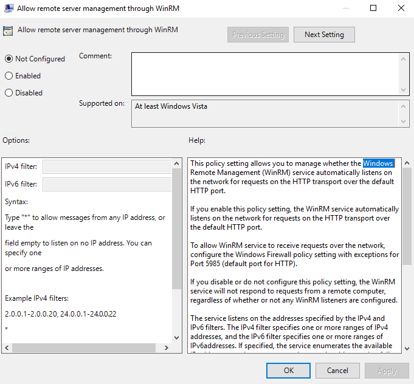

# Troubleshoot Failed Action Service Connections to Windows Resources (PSRemoting/WinRM)

## Overview

The NPS Action Service is used for various workflows, including host scans and performing pre- and post-session actions. The Action Service must establish a connection via PowerShell Remoting (PSRemoting) for Windows target resources. PSRemoting is a PowerShell implementation of WinRM (Windows Remote Management).

Several variables could affect the successful connection of the NPS Action Service to the target Windows resource via PSRemoting. This article outlines some of those variables and provides ways to troubleshoot and resolve them to establish a connection.

## Instructions

Before running tests, complete the following steps on the target resource:

### Verify PSRemoting and WinRM are enabled

In PowerShell, run the following command:

```powershell
Test-WSMan
```

The following output will appear if both PSRemoting and WinRM are enabled:

```
wsmid: http://schemas.dmtf.org/wbem/wsman/identity/1/wsmanidentity.xsd
ProtocolVersion : http://schemas.dmtf.org/wbem/wsman/1/wsman.xsd
ProductVendor   : Microsoft Corporation
ProductVersion  : OS: 0.0.0 SP: 0.0 Stack: 3.0
```

If PSRemoting and/or WinRM are not enabled on the target resource, the following output will appear:

```
Test-WSMan : <f:WSManFault xmlns:f="http://schemas.microsoft.com/wbem/wsman/1/wsmanfault" Code="2150858770""
Machine="%machine_name%"><f:Message>The client cannot connect to the destination specified in the request. Verify that
the service on the destination is running and is accepting requests. Consult the logs and documentation for the
WS-Management service running on the destination, most commonly IIS or WinRM. If the destination is the WinRM service,
run the following command on the destination to analyze and configure the WinRM service: "winrm quickconfig".
</f:Message></f:WSManFault>
At line:1 char:1
+ Test-WSMan
+ ~~~~~~~~~~
+ CategoryInfo          : InvalidOperation: (:) [Test-WSMan], InvalidOperationException
+ FullyQualifiedErrorId : WsManError,Microsoft.WSMan.Management.TestWSManCommand
```

**Resolution:** Run the following command in elevated PowerShell to enable PSRemoting/WinRM:

```powershell
Enable-PSRemoting
```

The following output will appear:

```
WinRM has been updated to receive requests.
WinRM service type changed successfully.
WinRM service started.

WinRM has been updated for remote management.
Created a WinRM listener on HTTP://* to accept WS-Man requests to any IP on this machine.
WinRM firewall exception enabled.
```

### Verify ports

Verify that ports 5985 (HTTP) and/or 5986 (HTTPS) are open in the Windows firewall and any network firewalls. These ports are used for WinRM communications for HTTP and HTTPS, respectively.

### Review Group Policy settings

There are Group Policy settings used to filter the origin of WinRM requests via both IPv4 and IPv6 filters. If issues with PSRemoting/WinRM communications persist even after enabling PSRemoting/WinRM and verifying firewall settings, it is possible that the IP filter in Group Policy is affecting the communication.

Learn more about the **Allow remote server management through WinRM** Group Policy setting in [Configure Remote Management in Server Manager − Enabling or Disabling Remote Management ⸱ Microsoft 🡥](https://learn.microsoft.com/en-us/windows-server/administration/server-manager/configure-remote-management-in-server-manager#enabling-or-disabling-remote-management).



### Allow full control to Remote Management Users

Review the access permissions set up for Remote Management Users by running the following command in elevated PowerShell:

```powershell
Get-PSSessionConfiguration -Name Microsoft.PowerShell
```

Review the permissions of the **BUILTIN\Remote Management Users** group under the **Permission** section. If set to **AccessDenied**, then authenticated network users (i.e., remote PSRemoting requests) will be denied access even if credentials and other variables are correct.

**Solution:** Run the following command in elevated PowerShell to review and change permissions for Remote Management Users:

```powershell
Set-PSSessionConfiguration -Name Microsoft.PowerShell -ShowSecurityDescriptorUI -Force
```

Select **Remote Management Users** and change **Full Control** from **Deny** to **Allow**, then click **Apply** and **OK**.

## Testing

Test the ability of the NPS Action Service to connect to a target resource via PowerShell Remoting by running the following PowerShell command on the server running Action Service:

```powershell
Invoke-Command -ComputerName %target_resource% -Credential (Get-Credential) -ScriptBlock { whoami }
```

> **IMPORTANT:** Replace `%target_resource%` with the target FQDN.

When prompted for credentials, use the credentials of the service account assigned to the target resource in NPS. If the remote request succeeds, it will return the username used for authentication.

```
PS C:\Users\admin> Invoke-Command -ComputerName TEST-DC -Credential (Get-Credential) -ScriptBlock { whoami }

cmdlet Get-Credential at command pipeline position 1
Supply values for the following parameters:
Credential
test\admin
```

The output indicates that the credentials used can run remote PowerShell commands on the target resource from the Action Service server via WinRM.

## Related articles

[Configure Remote Management in Server Manager − Enabling or Disabling Remote Management ⸱ Microsoft 🡥](https://learn.microsoft.com/en-us/windows-server/administration/server-manager/configure-remote-management-in-server-manager#enabling-or-disabling-remote-management)