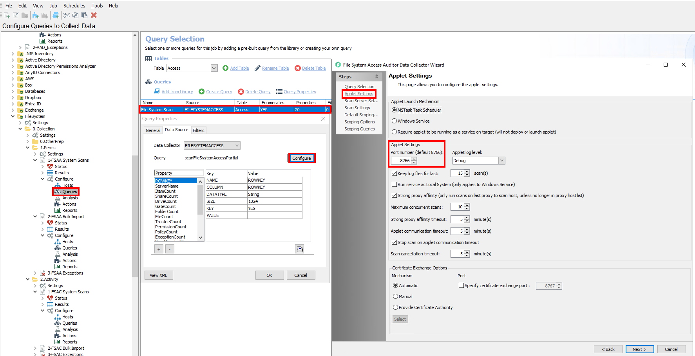

# Error: The Applet Is Not Running or Port 8767 Is Blocked

## Symptom

When attempting to connect to the FSAA applet, the following errors appear:

```
RPC: Checking the connection to host <HOST-NAME>.
Debug: RPC: **Failed** to bind. Protocol: ncacn_ip_tcp, Host: <HOST-NAME>, Endpoint: 8767, Secure: False. **Error**: The remote procedure call was **cancelled**.
Debug: **Cannot connect to the applet** RPC on '<HOST-NAME>'. **The applet is not running or port 8767 is blocked**. The remote procedure call was **cancelled**.
```

## Cause

The Proxy and File Action Module are using the same port.

## Resolution

You must adjust the ports for the FSAA scan. Set the **port of the Applet** plus 1 as the **port for the certificate exchange**.



1. Stop the **Netwrix Access Analyzer FSAA Proxy scanner** service.
2. Update the **Applet port** on the proxy. Run the following command to change the port based on the updated Applet port (the path may vary depending on your installation):

   ```plaintext
   sc config StealthAUDITFSAA binPath=""C:\Program Files (x86)\STEALTHbits\StealthAUDIT\FSAA\FSAAAppletServer.EXE" -e 8769"
   ```

3. Start the service in **Services**.
4. Verify in **Task Manager** that the service is running on the new port (e.g., `8769`).
5. In the FSAA scan configuration, set the **Applet port** to the new port.
6. In the FSAA scan configuration, set the port for the certificate exchange to the new port plus 1.

Once the scan is run, the proxy service will free up the port for the File Action Service.