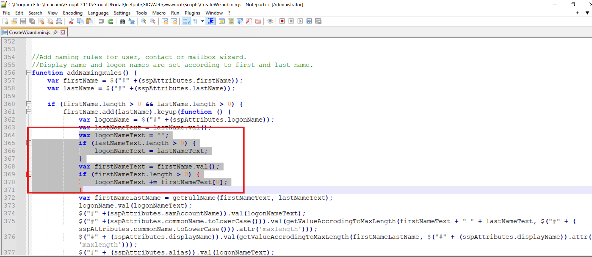
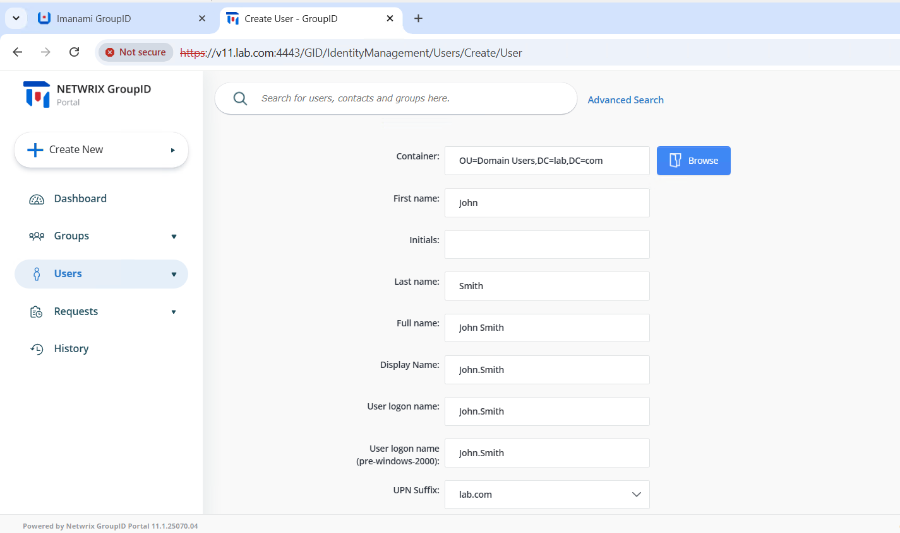

# How to Change the samAccountName, Alias, and User Logon Name Format to First.Last in the Portal

## Applies To

Directory Manager 11

## Overview

By default, Netwrix Directory Manager (formerly GroupID) generates user identifiers such as **samAccountName**, **alias**, and **user logon name** in the **LastF** format (for example, DoeJ for John Doe). Some organizations require a more standardized and readable format, such as **FirstName.LastName** (for example, John.Doe), to align with corporate policies and improve consistency. You can change this by modifying the portal’s script file. This article explains how to apply this change.

## Instructions

> **NOTE:** Test this change in a non-production environment before implementation. Always back up original files before making modifications.

### Modify the Naming Format for User Identifiers

1. Navigate to the following directory on your Directory Manager server:  
   `C:\Program Files\Imanami\GroupID 11.0\GroupIDPortal\Inetpub\<PortalName>\Web\wwwroot\Scripts`
   
2. Locate the following files:
   - `CreateWizard.js`
   - `CreateWizard.min.js`

3. Rename `CreateWizard.min.js` to `CreateWizard.min.backup.js`.

4. Open `CreateWizard.js` in **Notepad++** or another text editor.

5. Search for the function named `addNamingRules()`.

6. Replace the existing block:
   ```javascript
   var lastNameText = lastName.val();
   var logonNameText = "";
   if (lastNameText.length > 0) {
       logonNameText = lastNameText;
   }
   var firstNameText = firstName.val();
   if (firstNameText.length > 0) {
       logonNameText += firstNameText[0];
   }
   ```
   with the following:
   ```javascript
   var firstNameText = firstName.val().trim();
   var lastNameText = lastName.val().trim();
   var logonNameText = "";
   if (firstNameText.length > 0 && lastNameText.length > 0) {
       logonNameText = firstNameText + "." + lastNameText;
   }
   ```

   

7. Save the file.

8. Rename `CreateWizard.js` to `CreateWizard.min.js`.

9. Open **Command Prompt** as Administrator and run the following command:
   ```plaintext
   iisreset
   ```

10. After IIS is restarted, log in to the portal and create a new user. The **samAccountName**, **alias**, and **user logon name** will now be generated in the **First.Last** format.

