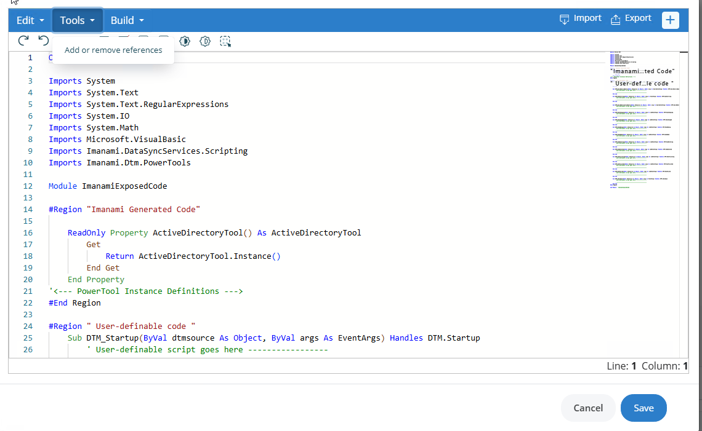
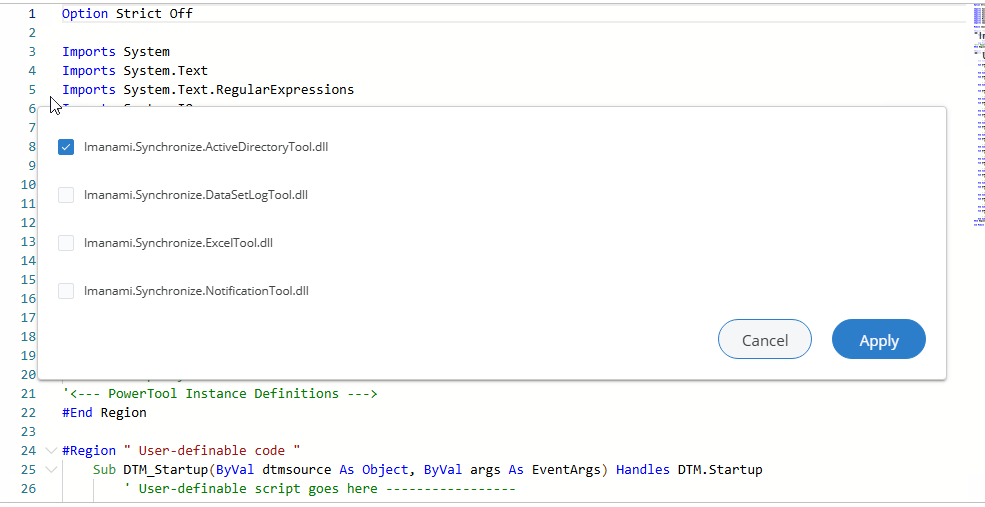
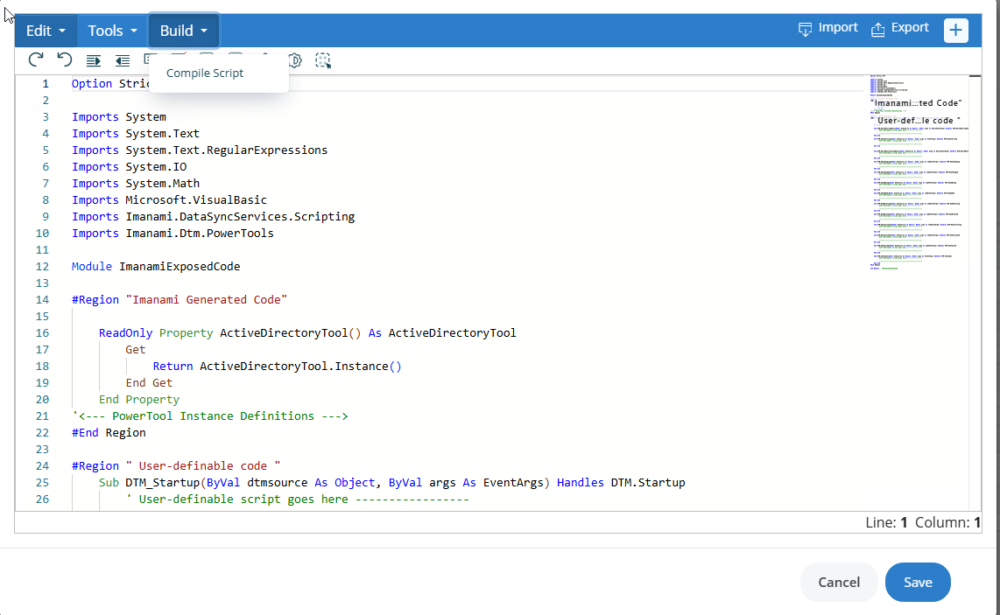
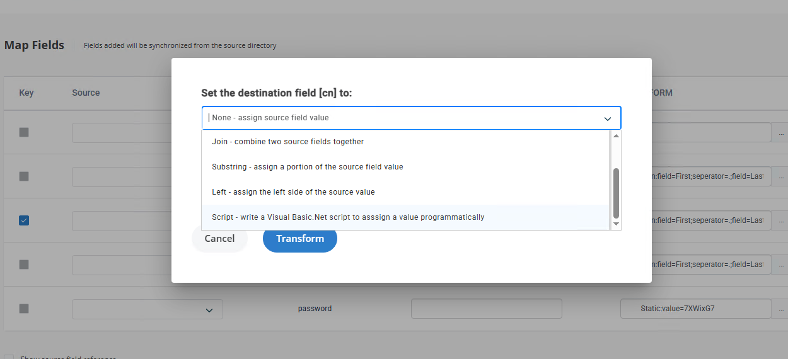
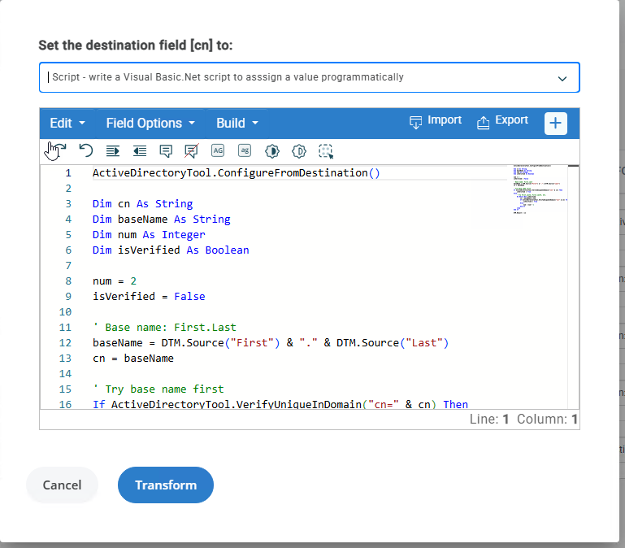

# How to Handle Duplicate First and Last Names When Creating Users with Synchronize Jobs

## Overview

When using **Netwrix Directory Manager** (formerly GroupID) Synchronize jobs to create user accounts in **Active Directory**, you may encounter a situation where the job fails if the new user's first and last name match those of an existing user. This occurs because Active Directory does not allow duplicate Common Names (CN) within the same Organizational Unit (OU). This article explains how to configure a Synchronize job to automatically append a number to the CN, ensuring each new account has a unique CN.

## Instructions

1. In the **Directory Manager Management Console**, expand the **Synchronize** node.
2. Right-click **All Jobs** and select to create a new job or edit the existing job where you are facing the issue.
3. Provide the required information for the **Source** and **Destination** directories on the respective wizard pages.
4. On the **Sync Object** page, select the appropriate user type (for example, User, Mail-enabled User).
5. On the **Select Fields** page, choose the necessary attributes.
6. On the **Field Map(s)** page, click **Edit Global Script**.

   

7. In the **Global Script Editor**, click **Tools > Add/Remove Reference**.

   

8. Select **Imanami.Synchronize.ActiveDirectoryTool.dll** and click **Apply**.

   

9. Click **Build > Compile Script** to ensure the reference is added successfully.

   

10. On the **Field Map(s)** page, click the **Transform** button next to **cn**.

    

11. In the **Transform** dialog, select **Script** from the drop-down.

    

12. Paste the following script, adjusting `DTM.Source("First")` and `DTM.Source("Last")` if your source attribute names differ:

    ```plaintext
    ActiveDirectoryTool.ConfigureFromDestination()

    Dim cn As String
    Dim baseName As String
    Dim num As Integer
    Dim isVerified As Boolean

    num = 2
    isVerified = False

    ' Base name: First.Last
    baseName = DTM.Source("First") & "." & DTM.Source("Last")
    cn = baseName

    ' Try base name first
    If ActiveDirectoryTool.VerifyUniqueInDomain("cn=" & cn) Then
        isVerified = True
    Else
        ' Try First.Last2, First.Last3, etc.
        Do While Not isVerified
            cn = baseName & num
            If ActiveDirectoryTool.VerifyUniqueInDomain("cn=" & cn) Then
                isVerified = True
            Else
                num = num + 1
            End If
        Loop
    End If

    DTM.Result = cn
    ```

    

13. Click the **Build** button and **Test Script**. Use test data with a duplicate first and last name to confirm the CN is generated with a number appended. If it shows `<empty>`, you can ignore it as the job will run correctly.
14. Click **OK** to save and close the editor.
15. Finish the remaining wizard steps and run the job.
16. The job will now create accounts with unique CNs, appending a number if a duplicate is detected (for example, `John.Smith2`, `John.Smith3`).

> **IMPORTANT:** Test this process with non-production data before applying it to your production environment to avoid unintended changes.