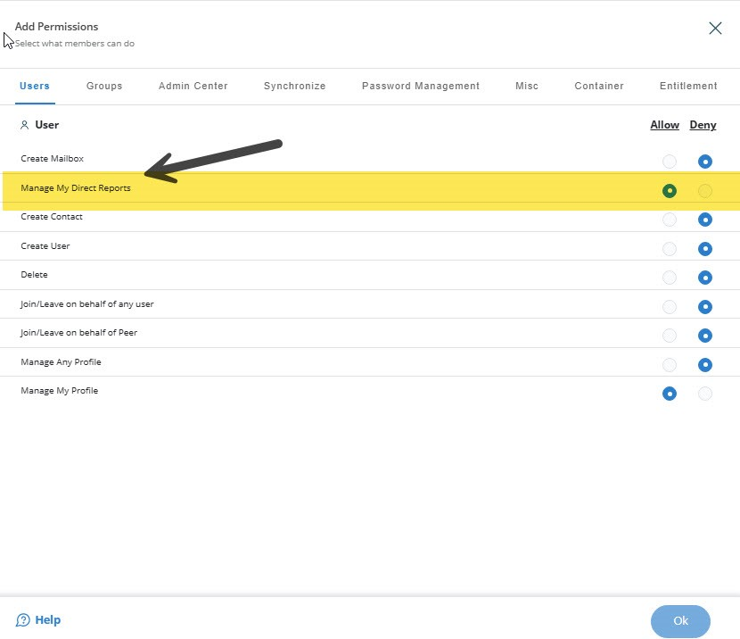
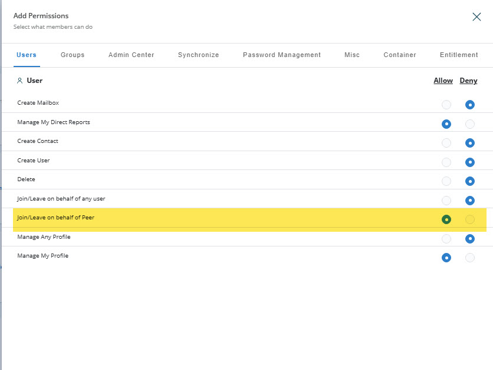
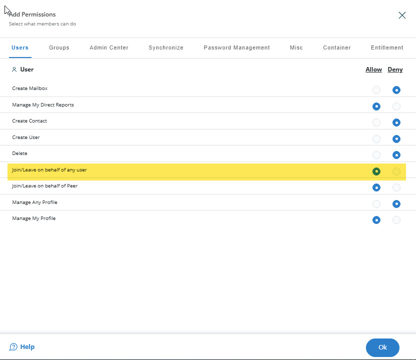
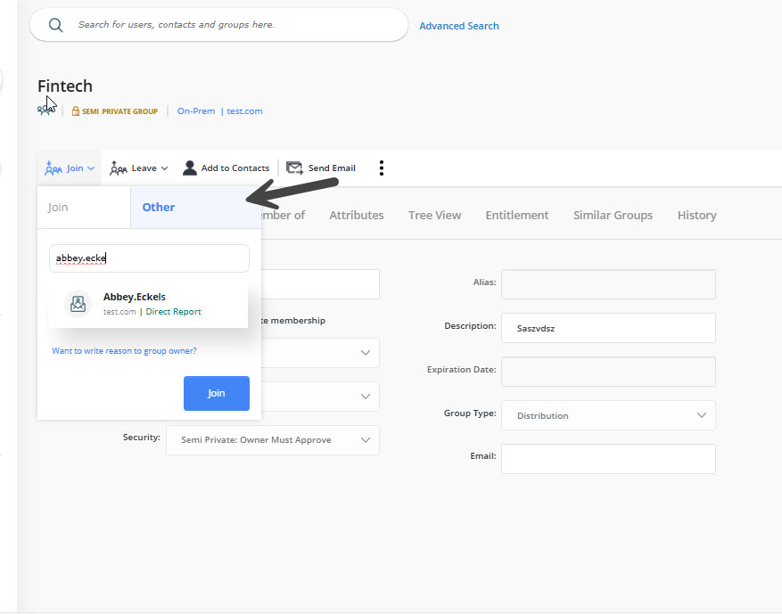
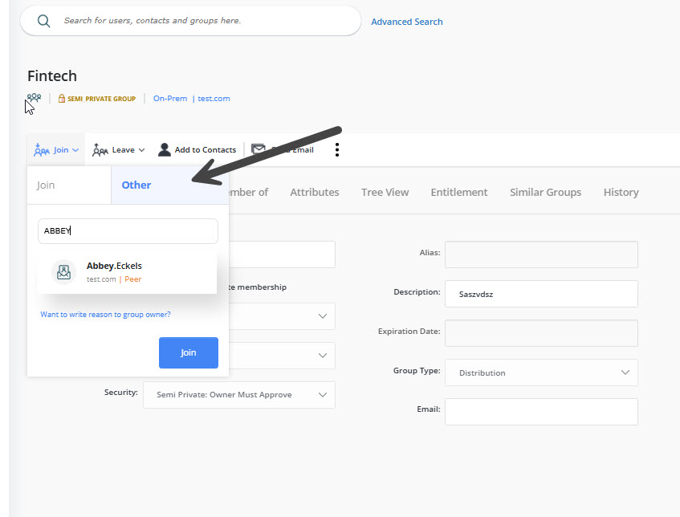
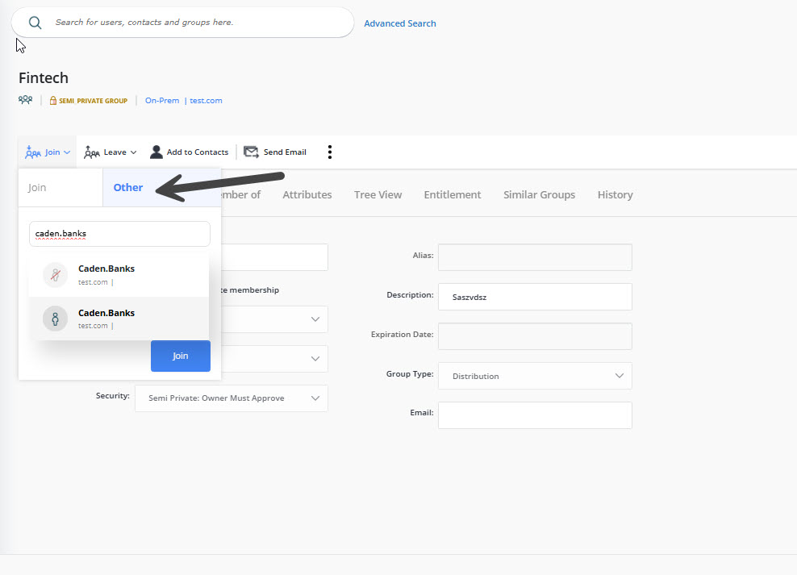

# Join or Leave a Group on Behalf of Another User

## Applies To

Netwrix Directory Manager 11

## Overview

Netwrix Directory Manager (formerly GroupID) allows managers and users to request to join or leave groups on behalf of other users. This feature streamlines group membership management, making it easier for managers to add their direct reports to relevant groups or for users to assist peers. Permissions for these actions are controlled by security roles in Directory Manager.

## Instructions

### Permissions Required for Join/Leave Requests

| Feature                             | Description                                                                                                         | Identity Store Permission                                                                                     |
|-------------------------------------|---------------------------------------------------------------------------------------------------------------------|---------------------------------------------------------------------------------------------------------------|
| Join/Leave on Behalf of Direct Reports | A manager can place a request to join or leave a group on behalf of users who report directly to them.           | **Manage My Direct Reports** permission must be set to **Allow** for the security role of the requesting manager. |
| Join/Leave on Behalf of Peers      | Users can place a request to join or leave a group on behalf of their peers (users who report to the same manager). | **Join/Leave on Behalf of Peer** permission must be set to **Allow** for the security role of the requesting user. |
| Join/Leave on Behalf of Any User   | Any user can place a request to join or leave a group on behalf of any other user.                                 | **Join/Leave on Behalf of Any User** permission must be set to **Allow** for the security role of the requesting user. |

### Set Permissions for Join/Leave Requests

1. In the Directory Manager Admin Center, click the identity store node.
2. Go to the properties of the required identity store.
3. On the **Security Roles** tab, select the relevant security role and click **Edit**.
4. On the **Permissions** tab, set the appropriate permission to **Allow**:
   - **Manage My Direct Reports** for managers.
   - **Join/Leave on Behalf of Peer** for peers.
   - **Join/Leave on Behalf of Any User** for any user.

### Request to Join or Leave a Group on Behalf of Direct Reports

1. In the Directory Manager portal, search for the group (e.g., Fintech) and open its properties.
2. Click **Join**. A dialog box appears.
3. Click **Other** to place the request on behalf of a direct report.
4. Search for and select the desired direct report, then click **Join**.
5. An email notification is sent to both the group owner and the user. Once the request is approved, all parties are notified of the decision.

### Request to Join or Leave a Group on Behalf of Peers

1. In the Directory Manager portal, search for the group and open its properties.
2. Click **Join**. A dialog box appears.
3. Click **Other**.
4. Search for and select the desired peer, then click **Join**.
5. An email notification is sent to both the group owner and the peer. Once the request is approved, all parties are notified of the decision.

### Request to Join or Leave a Group on Behalf of Any User

1. In the Directory Manager portal, search for the group and open its properties.
2. Click **Join**. A dialog box appears.
3. Click **Other**.
4. Search for and select the desired user, then click **Join**.
5. An email notification is sent to both the group owner and the user. Once the request is approved, all parties are notified of the decision.

