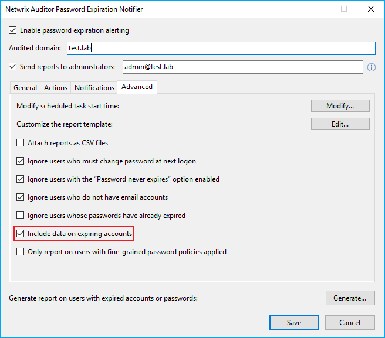
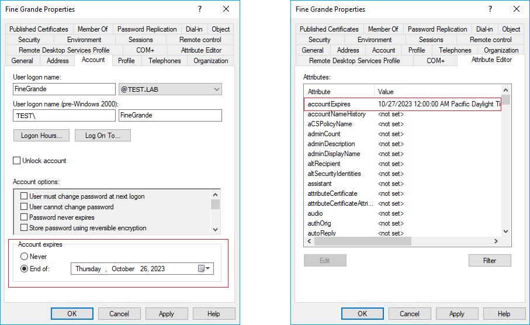

# Account and Password Expiration Mismatch in Netwrix Password Reset

## Question

Reports in Netwrix Password Reset (PEN) state users are to expire sooner than what is stated in Active Directory. What could be causing this?

## Answer

Password Expiration Notifier may include data on expiring accounts, if enabled. If the account is to expire sooner than the password, the account expiration date will be stated in the report instead of the password expiration date. Refer to the following steps to either track both expiring passwords and accounts or disable the option to track expiring accounts:

1. In your **Start** menu, select **Netwrix Password Reset**.
2. Select the monitoring plan, and click **Edit**.
3. Select the **Advanced** tab, and either check or uncheck the **Include data on expiring accounts**.
4. The next report will be affected.

To verify the account expiration date, refer to the following steps:

1. Open **Active Directory Users and Computers** either via **Server Manager** > **Tools**, or the Search bar.
2. Right-click the user, and select **Properties**.
3. The account expiration date is provided in the **Account** tab > **Account expires**, and the **Attribute Editor** tab > `accountExpires` attribute.

### Related articles

- [How Long Until My Password Expires? ⸱ Microsoft 🙅](https://learn.microsoft.com/en-us/previous-versions/windows/internet-explorer/ie-developer/scripting-articles/ms974598(v=msdn.10)?redirectedfrom=MSDN)
