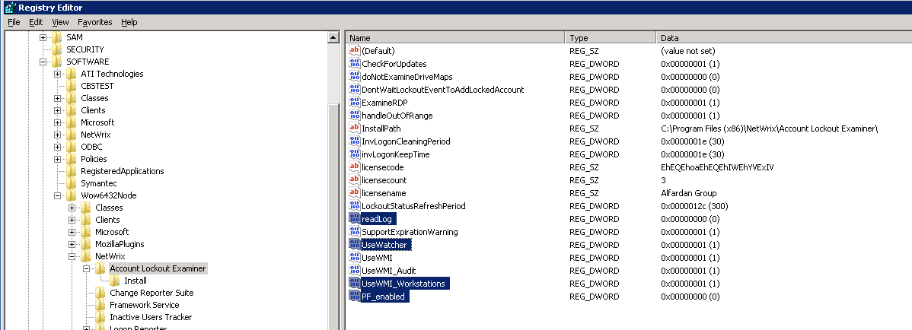

# Account Lockout Examiner generates excessive traffic in the network

Netwrix Account Lockout Examiner gets information from Windows security logs. The product connects to domain controllers (DCs) to find lockout events. Then it connects to workstations to find detailed information about the invalid logon attempts, which caused the lockouts. When the product is configured to monitor all DCs in your domain, it establishes connections with all DCs as well as their subject workstations.

## To reduce the bandwidth usage

1. Run Registry Editor: navigate to **Start** > **Run**, type in `regedit` and click **OK**.
2. Navigate to `HKLMSoftware[Wow6432Node]NetWrixAccount Lockout Examiner (Wow6432Node only for x64 OS).`
3. Set `readlog` to `0`.
4. Create a new DWORD value `UseWatcher` and set its value to `1`.
5. Set `UseWMI_Workstations` to `1`
6. Restart Netwrix Account Lockout Examiner Service via the **Services** snap-in.

This will change method of event collection and should reduce bandwidth utilization.

There is also an option to disable examination of workstations. In this case name of the process that cause invalid logon will never be shown..

## To disable examination of workstations

1. Run Registry Editor: navigate to **Start** > **Run**, type in `regedit` and click **OK**.
2. Navigate to `HKLMSoftware[Wow6432Node]NetWrixAccount Lockout Examiner (Wow6432Node only for x64 OS).`
3. Create a new DWORD value `PF_Enabled` and set its value to `0`.
4. Restart Netwrix Account Lockout Examiner Service via the **Services** snap-in.

