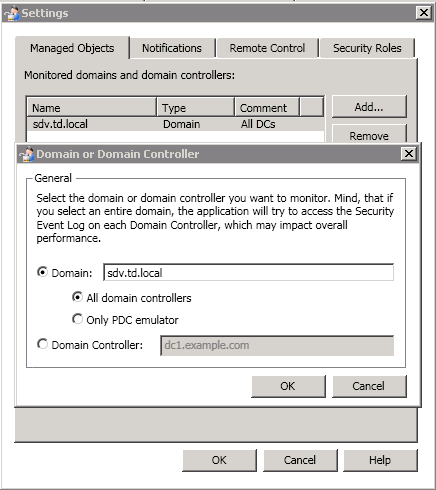

# Account lockouts are displayed with delay

It takes a long time for account lockouts to be reflected in NetWrix Account Lockout Examiner (ALE).

---

This might happen if ALE is set to monitor the Primary Domain Controller (PDC) only. If an account gets locked on a different domain controller, it takes time for the lockout event to replicate to the PDC, and this causes the delay.

Another possible reason is very high activity in your domain that generates more events per second than the product can handle. As a result an event queue and a delay occurs.

---

## Resolution

To fix the issue, set the product to monitor all DCs in the monitored domain and change event processing method.

### Monitor all domain controllers

To change to all DCs mode, perform the following steps:

1. In NetWrix Account Lockout Examiner navigate to **File > Settings > Managed Objects**.
2. Select your domain and click **Edit**.
3. Select **All DCs** radio button and click **OK** to save the changes.

### Change event processing method

1. Open the Registry Editor (navigate to **Start > Run** and type `regedit`).
2. Navigate to `HKEY_LOCAL_MACHINE\SOFTWARE\NetWrix\Account Lockout Examiner` (use `Wow6432Node` only for x64 OS).
3. Locate the `readlog` key and set its value to `0`.
4. Create a new value called `UseWatcher`, set its type to `DWORD` and value to `1`.
5. Restart NetWrix Account Lockout Examiner Service via `services.msc`.

