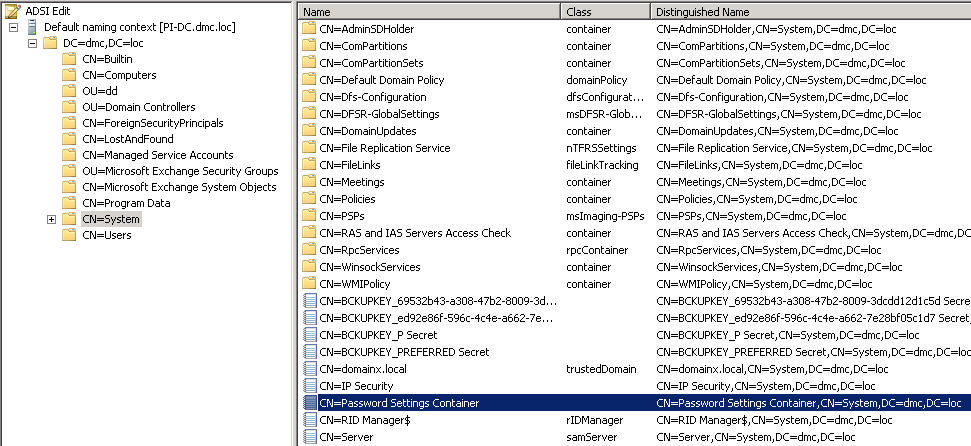

# Ad-Hoc and Email reports shows different results in one-way-trust forests environment

Password Expiration email report (being delivered automatically) and Ad-hoc report (generated manually) provide a different number of user accounts in the following operating environment:

## Environment
- Netwrix Auditor is configured to monitor password expirations in a domain which belongs to the forest with one-way trusts established.
- The password policy in the target domain is set granularly by using the Fine Grained Password Policy (FGP).
- Netwrix Auditor is set to report on users with Fine Grained Policy Settings (the **Only report on users with Fine Grained Policy Settings** checkbox is checked).

---

This could happen because the Data Processing Account that is being used to collect data does not have enough permissions to read the Password Settings Container from the target domain. While the Ad-Hoc is being run under a different account which can read the Password Settings Container

---

## To check Data Processing Account permissions
To check if the Data Processing Account has enough permissions please perform the following steps:

1. Run ADSI Edit as the Data Processing Account (refer to the KB if you need to install ADSI Edit utility): https://kb.netwrix.com/743
2. Connect to the target domain Default Naming Context.
3. Navigate to the `CN=System`.
4. Try to open `CN=Password Settings Container` and read the PSO.

If you do not see the `CN=Password Settings Container` under the `CN=System` node or cannot read the properties this indicates Data Processing Account does have read rights (see the screenshot below: the account does not have rights to access the Password Settings Container).

## To provide read permissions to the Data Processing Account
1. Run ADSI Edit as a domain Administrator.
2. Connect to the target domain Default Naming Context.
3. Navigate to the `CN=System`.
4. Right-click `CN=Password Settings Container`, select **Properties**, go to the **Security** tab and add the Data Processing Account and specify Read permissions.

Once the read permission for the Data Processing Account is set, verify the access by opening the `CN=Password Settings Container` properties with the Data Processing Account. This time you should be able to see `CN=Password Settings Container` under the `CN=System` node and read its properties (see the screenshot below).

