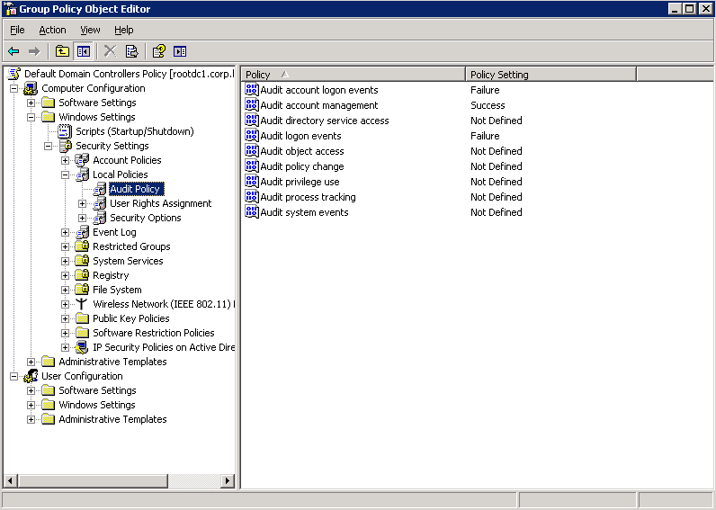
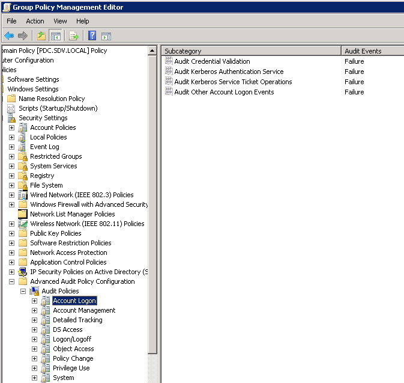
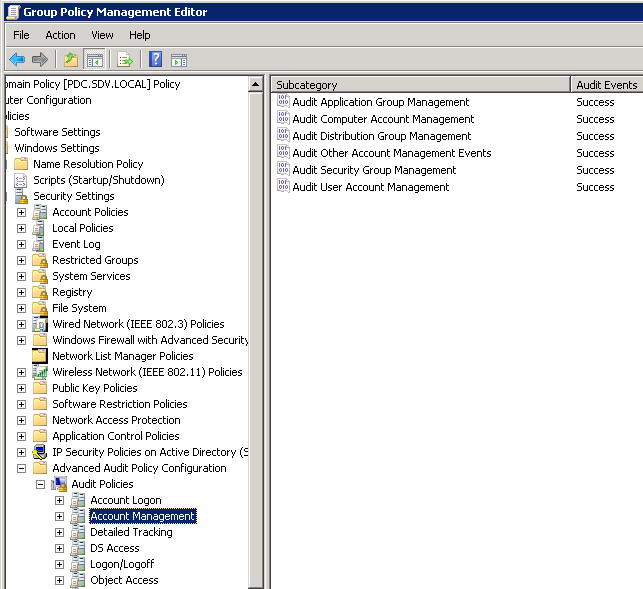
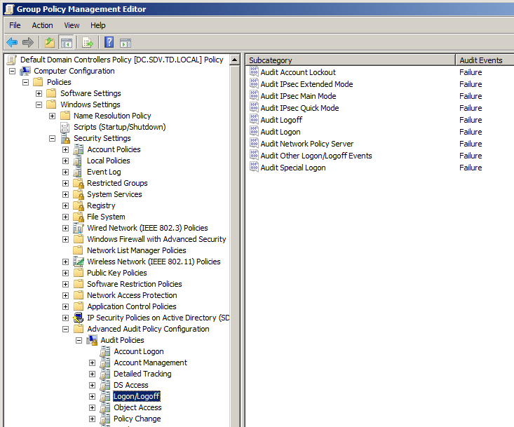
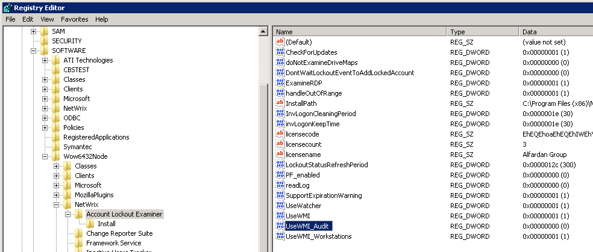

# Audit Status shows "Logon auditing is disabled"

Audit status of some Domain controllers in the list shows that some auditing is disabled, for example "Logon Auditing is disabled, some funcionality will be unavailable for this DC. Please turn on auditing of invalid logons in audit policy for this DC"

---

This message can occur if audit policies in your domain are not set. In this case product will not work because no lockout events will be present.

But the message can also occur even if correct audit policy is set in your domain. It can happen because in Windows XP/2003/Vista/2008 Account Lockout Examiner checks only if 3 policies under Local policy - Audit policies node of Group policy are configured, but in Windows 7/2008R2 Account Lockout Examiner checks if Advanced Audit Policies are configured, so you might get such warning even if default 3 Audit policies are set, but advanced are not.

.

---

To resolve the issue configure audit policies/ advanced audit policies.

## For Windows 2003/2008 domain

1. On any DC, launch the **Group Policy Management** console.
2. Right-click the appropriate **Group Policy Object** linked to the **Domain Controllers** container and select **Edit**.
3. Expand the **Computer Configuration** -> **Windows Setting** -> **Security Settings** -> **Local Policies** -> **Audit Policy** node.
4. Configure audit policies as follows:
   - **Account Management: Success**
   - **Audit account logon events: Failure**
   - **Audit logon events: Failure**

   

5. Update group policy an all monitored DCs (for example run `gpupdate /force`)

## For Windows 2008R2 or above domain

1. On any DC, launch the **Group Policy Management** console.
2. Right-click the appropriate **Group Policy Object** linked to the **Domain Controllers** container and select **Edit**.
3. Expand the **Computer Configuration** -> **Policies** -> **Windows Settings** -> **Security Settings** -> **Advanced Audit Policy Configuration** node.
4. Configure audit policies according to page 12, Section 4.2: Enabling Audit Policy, of the [Account Lockout Examiner Administrator Guide](https://www.netwrix.com/download/documents/NetWrix_Account_Lockout_Examiner_Administrator_Guide.pdf?_ga=2.126161166.2092059225.1569427026-1766003445.1557946744).

  

5. Update group policy an all monitored DCs (for example run `gpupdate /force`)

However, Windows 2008R2 and above allows to configure audit policy in the same way as it was in Windows 2003 and 2008. In this case some of required events will be generated and Account Lockout Examiner will work, however the Auditing is disabled message will be shown.

## Disable Audit status check (optional)

If you don`t want to configure Advanced audit policies, there is an option to disable Audit status check in Account Lockout Examiner. In this case Audit status will always be shown as OK.

In order to do this:

1. Run Registry Editor (Start - Run - `regedit`)
2. Navigate to `HKEY_LOCAL_MACHINESoftware[Wow6432Node]NetWrixAccount Lockout Examiner` (Wow6432Node is present only in 64-bit OS)
3. Change the value of **UseWMI_Audit** to `0`,
4. In the Account Lockout Examiner console go to **File - Settings** and click **OK** to apply registry changes.

