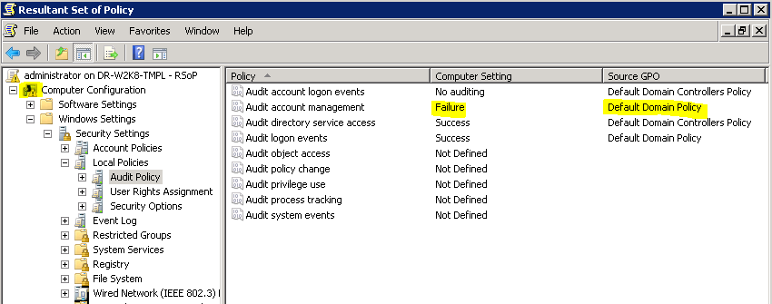
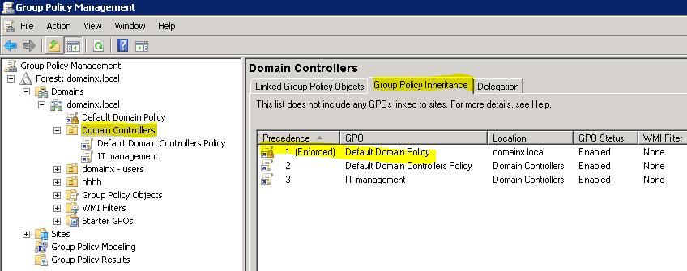
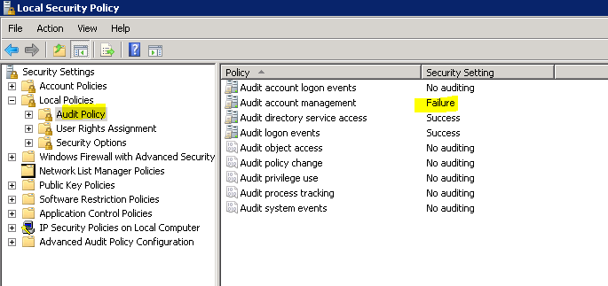

# Auditing policies are not being enabled on all or several domain controllers

You have configured change auditing in accordance with the Installation and Configuration guide (Installation and Configuration Guide)[http://www.netwrix.com/download/documents/NetWrix_Active_Directory_Change_Reporter_Installation_Configuration_Guide.pdf], however auditing policies are not being applied and Netwrix Auditor keeps complaining about audit settings on all or some domain controllers. In addition to this, all or some changes in summary reports are listed as made by the System account.

The reasons why the auditing policies are not being enabled on domain controllers in the managed domain may be:

1. The GPO you configured auditing policies in is not being distributed to problematic domain controllers.
2. The GPO you configured auditing policies in is being distributed to problematic domain controllers but auditing policies are not being applied.

## Verify GPO distribution with Resultant Set of Policy (RSoP)

1. Make sure the GPO you configured auditing policies in is being distributed to problematic domain controllers. For that please use Resultant Set of Policy (RSoP): http://technet.microsoft.com/en-us/library/cc782615(v=ws.10).aspx

- Log onto the domain controller which Netwrix Auditor is complaining about.
- Run Resultant Set of Policy (RSoP): `Start > Run` > type `rsop.msc` and press Enter.
- Expand Audit Policy as shown in the picture below and make sure you see the corresponding source GPO (the GPO which you enabled auditing policies in) for auditing policies and ensure there are no warnings or errors. In our case we see that Audit Account Management policy is set to Failure, while for successful auditing we need to have this policy set to Success.

- To fix this problem open **Group Policy Management Console** (**Start > Administrative Tools > Group Policy Management**), select the **Domain Controllers** node, open the **Group Policy Inheritance** tab and in the right pane review the order the GPOs are being applied to the Domain Controllers OU. In our case the Default Domain Policy is enforced and being applied first which causes a GPO conflict. Manage your GPO inheritance to exclude the necessary policy settings from being overridden. For more details regarding GPO inheritance please refer to the following Microsoft KB article: http://technet.microsoft.com/en-us/library/cc757050(v=ws.10).aspx

## If GPO distribution is correct but auditing settings still not applied

If you resolved the inheritance issue and corresponding GPOs are being distributed to the problematic domain controller but Netwrix Auditor still complains about auditing settings, this may indicate that auditing policy settings are not being applied on the domain controller. To troubleshoot this you can use Local Group Policy Editor: http://technet.microsoft.com/en-us/library/cc731745.aspx

1. Log onto the domain controller which Netwrix Auditor is complaining about.
2. Open Local Group Policy Editor: `Start > Run` > `secpol.msc`.
3. Expand Audit Policy as shown in the picture below and make sure that the necessary auditing policies are set to Success (for example, Audit Account Management, Audit Directory Service Access) and are equal to the ones you see in Resultant Set of Policy (RSoP).

- If the Local Group Policy Editor indicates different auditing settings (different from the ones you configured and see in Resultant Set of Policy (RSoP)), this may indicate an issue with GPO applying on that particular domain controller. To troubleshoot this issue please refer to the following Microsoft KB articles:

  - Security auditing settings are not applied to Windows Server 2008-based computers when you deploy a domain-based policy: http://support.microsoft.com/kb/921468
  - Troubleshooting Group Policy Problems: http://technet.microsoft.com/en-us/library/cc787386(v=ws.10).aspx
  - Group Policy Analysis and Troubleshooting Overview: http://technet.microsoft.com/en-us/library/jj134223.aspx
  - Fixing Group Policy problems by using log files: http://technet.microsoft.com/en-us/library/cc775423(WS.10).aspx
  - SceCli 1202 events are logged every time Computer Group Policy settings are refreshed on a computer that is running Windows Server 2008 R2: http://support.microsoft.com/kb/974639/en-us
