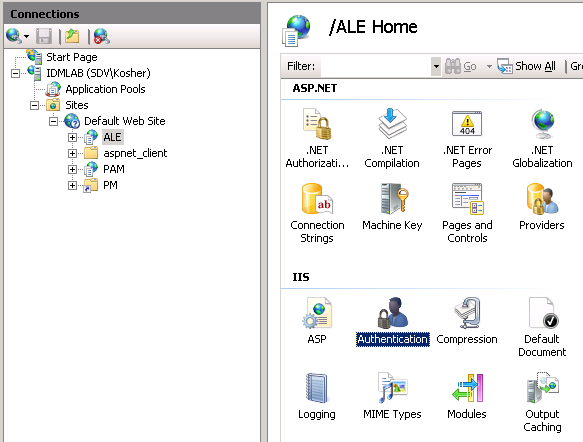

# Cannot access the Help-Desk portal

When using the web portal for Netwrix Account Lockout Examiner, you may be repeatedly prompted for a password even after you type the correct one. Why does the password never get accepted?

This error indicates your authentication settings need to be adjusted to comply with the following:

1. The account you are using to access the Help-Desk portal is added to the local **Administrators** group or at least granted the **Help-desk operator security role**. For detailed information on the security roles, refer to the following Netwrix KB article: https://kb.netwrix.com/2735 (How to restrict access to the Help-Desk portal and the Administrative Console).

2. All authentication types except **Windows authentication** or **Basic authentication** are disabled in the **Internet Information Services (IIS) Manager**, and either Windows or Basic authentication is enabled.

   To ensure the required settings are enabled in **IIS6**, do the following:
   a) In the **IIS Manager** left pane, navigate to the **ALE** virtual directory (by default `\<your computer name> -> Web Sites -> Default Web Site -> ALE`).  
   b) Right-click the **ALE** folder and select **Properties**.  
   c) In the **Properties** dialog, open the **Directory Security** tab, and select **Edit** for **Authentication and Access Control**.  
   d) In the **Authentication Methods** dialog, select either the **Integrated Windows authentication** box or **Basic authentication** (password is sent in clear text), and clear all other authentication options for Authentication access.

   

   To ensure the required settings are enabled in **IIS7**, do the following:
   a) In the **IIS Manager** left pane, navigate to the **ALE** virtual directory (by default `\<your computer name> -> Sites -> Default Web Site -> ALE`).  
   b) In the Manager central pane, double-click the **Authentication** option.  
   c) In the Authentication list, enable either the **Windows Authentication** option or **Basic Authentication**, and disable all other authentication options.

   

3. Your proxy server is disabled or bypassed. To check the proxy settings, do the following:
   a) Go to **Control panel -> Internet options**.  
   b) In the **Internet Properties** dialog, open the **Connections** tab and click the **LAN settings** button.  
   c) Make sure the **Use a proxy server for your LAN** option is not enabled. Otherwise, make sure the **Bypass proxy server for local addresses** option is enabled too; in this case the Help-Desk portal must be a member of the **Local intranet zone**, or specified as exception.

   

4. The account you are using has READ access to the physical directory of the Web-portal (by default `C:Program Files (x86)NetWrixAccount Lockout ExaminerWeb`)
