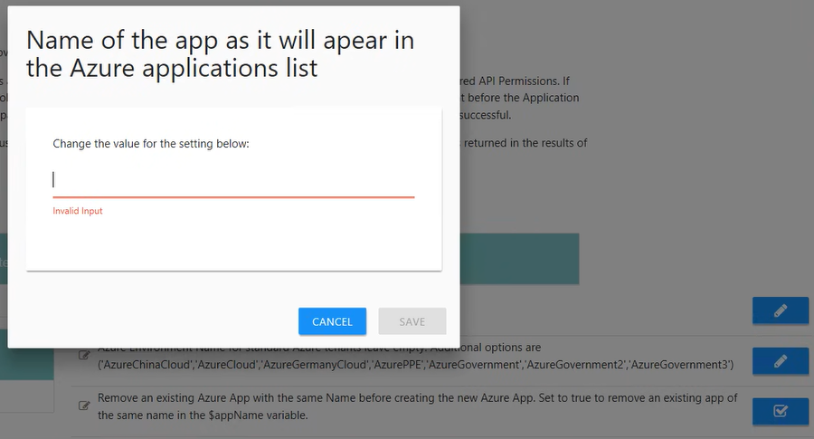
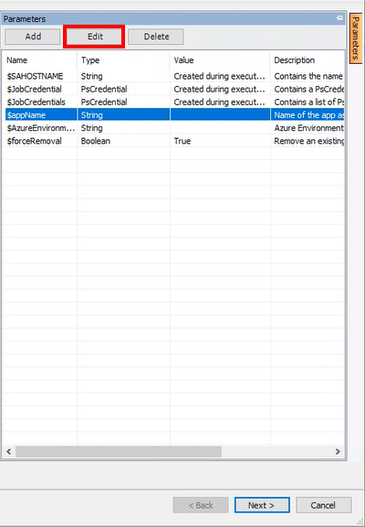

# Cannot Remove UI Configuration from Jobs Using PowerShell Data Collector Jobs with Parameters

## Symptom

In the **Netwrix Access Analyzer** (formerly **Enterprise Auditor**) Management Console, you cannot remove an unneeded output path in a job's configuration settings via the UI. When the path is removed, the option to save the setting appears disabled as shown below.

## Cause

The current design of the **Access Analyzer Management Console** does not allow saving empty values for the UI configuration fields within the job configuration settings.

## Resolution

To remove the output path variable, use the **PowerShell Data Collector** wizard as a workaround:

1. Open the job query in the **Access Analyzer Management Console**.
2. Highlight the needed query and select **Query Properties**.
3. In the **Query Properties** pop-up window, click **Configure**.
4. Select the **Edit Query** option.
5. Click the **Parameters** button on the right side of the Edit PowerShell Query Settings.
6. Select the parameter to be cleared and click **Edit**.  
     
   
7. Once the value box appears, delete the value and click **OK**.  
     
   
8. Complete the rest of the **PowerShell Data Collector** wizard by clicking **Next** and **Finish**.
9. Click **OK** on the query properties box.
10. Return to the job page and verify that the output path variable is empty.

> **NOTE:** This workaround is temporary. A feature request has been submitted to allow saving empty values directly through the UI in a future release.