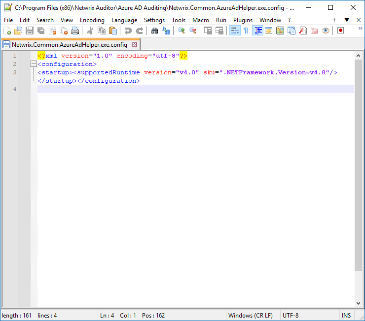
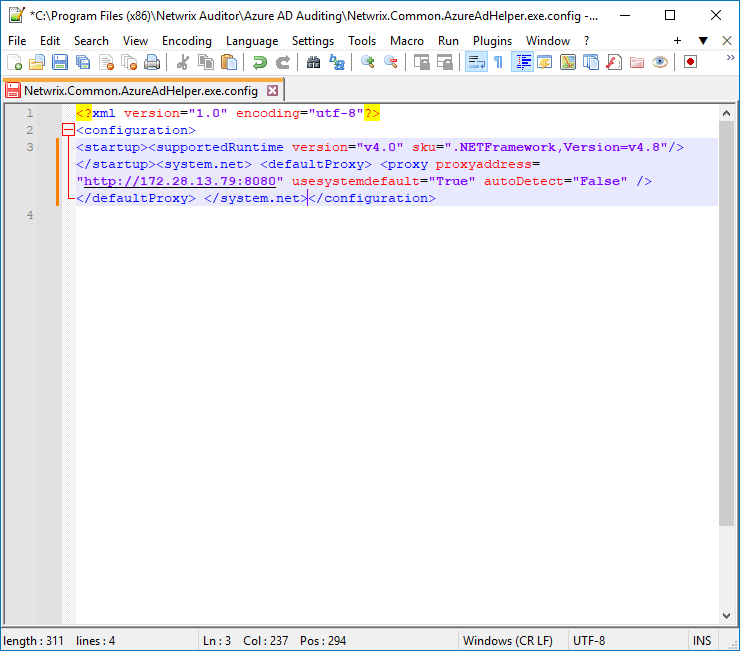

# Configure Microsoft 365 Data Sources to Use Proxy Server Settings

## Question

How to configure Microsoft 365 (Office 365) data sources to use proxy server settings?

## Answer

### Exchange Online

Exchange Online relies on PowerShell gathering proxy settings from the network adapter. Browser proxy settings in Windows are not propagated to the network adapter by default. Refer to the following steps to set up proxy settings for Exchange Online:

1. In elevated Command Prompt, check the network adapter settings:

   ```bash
   netsh winhttp show proxy
   ```

   

2. If the system prompts **Direct settings**, configure the network adapter to use the correct proxy settings:

   ```bash
   netsh winhttp set proxy proxy-server="http=***.***.***.***:port;https=***.***.***.***:port"
   ```

   Replace the proxy server settings in the line with your actual settings.

   

### Microsoft Entra ID (formerly Azure AD)

To use proxy server settings for the Microsoft Entra ID audit, edit the following files:

- `Netwrix.Common.AzureAdHelper.exe.config`
- `Netwrix.O365.AzureAdCollector.exe.config`
- `Netwrix.O365.AzureAdDiffQueryCollector.exe.config`
- `Netwrix.O365.AzureADDumper.exe.config`
- `Netwrix.O365.AzureAdManagementApiCollector.exe.config`
- `Netwrix.O365.AzureAdReporter.exe.config`

Add the following line at the end of each file before the `</configuration>` tag:

```xml
<system.net> <defaultProxy> <proxy proxyaddress="***.***.***.***:port" usesystemdefault="True" autoDetect="False" /> </defaultProxy> </system.net>
```

Before editing:

```xml
<?xml version="1.0" encoding="utf-8" ?> <configuration> <startup useLegacyV2RuntimeActivationPolicy="true"> <supportedRuntime version="v4.0.30319"/> <supportedRuntime version="v2.0.50727"/> </startup> </configuration>
```

After editing:

```xml
<?xml version="1.0" encoding="utf-8" ?> <configuration> <startup useLegacyV2RuntimeActivationPolicy="true"> <supportedRuntime version="v4.0.30319"/> <supportedRuntime version="v2.0.50727"/> </startup> <system.net> <defaultProxy> <proxy proxyaddress="***.***.***.***:port" usesystemdefault="True" autoDetect="False" /> </defaultProxy> </system.net> </configuration>
```

Before editing image:



After editing image:



Replace `***.***.***.***:port` with your actual proxy settings.

### SharePoint Online

To use proxy server settings for the SharePoint Online audit, edit the following files:

- `Netwrix.Common.AzureAdHelper.exe.config`
- `SpaOnlineHost.exe.config`

Add the following line at the end of each file before the `</configuration>` tag:

```xml
<system.net> <defaultProxy> <proxy proxyaddress="***.***.***.***:port" usesystemdefault="True" autoDetect="False" /> </defaultProxy> </system.net>
```

Replace `proxyaddress="***.***.***.***:port"` with your actual proxy settings.

### Microsoft Teams

To use proxy server settings for the Teams audit, set up both Microsoft Entra ID and SharePoint Online settings.
