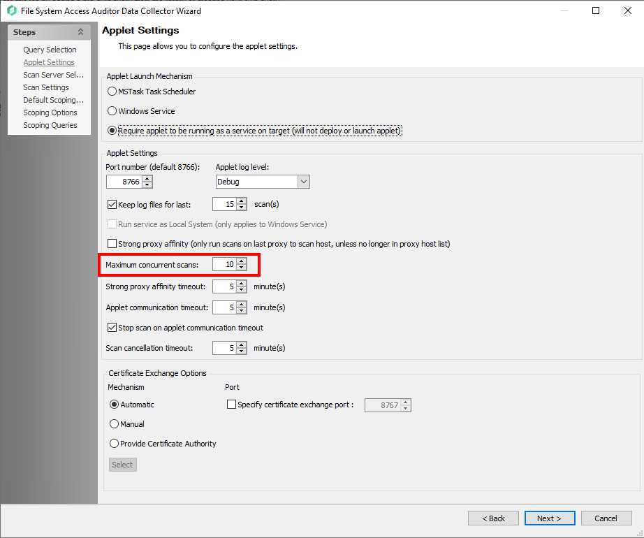
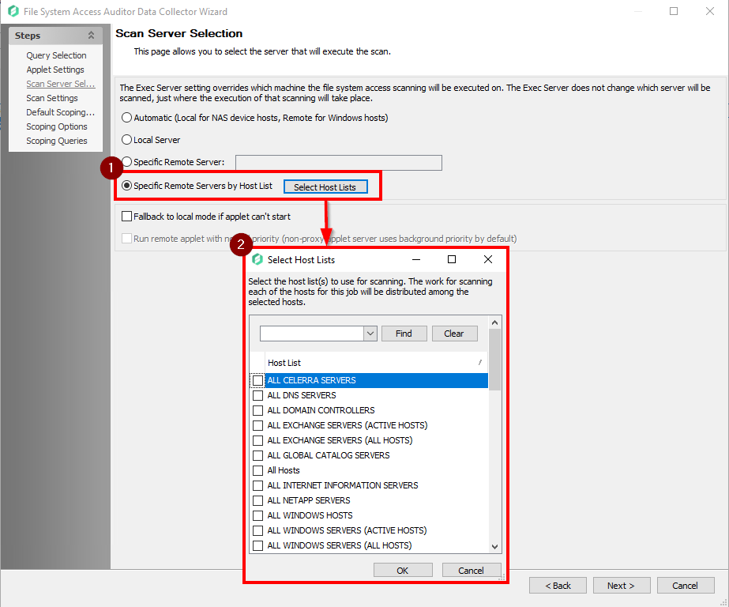
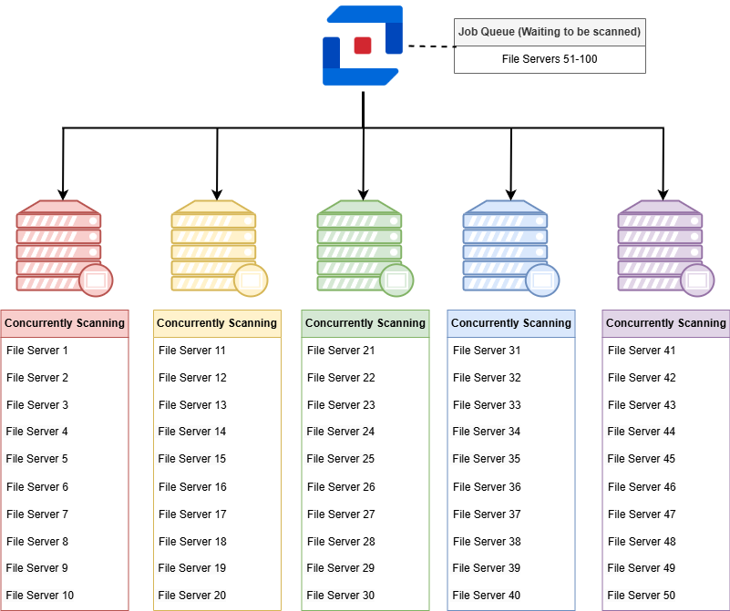
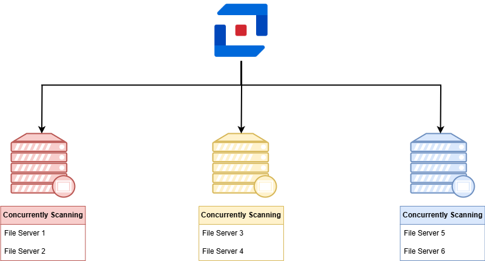

# Configuring Proxy Scans in Netwrix Access Analyzer

## Overview

When using a proxy host list in Netwrix Access Analyzer (formerly Enterprise Auditor), it is important to configure your scan settings correctly. Proper configuration ensures that multiple proxy servers can simultaneously scan multiple target hosts, improving efficiency and scan performance. This article outlines the necessary steps and settings to optimize scanning using proxy host lists.

## Instructions

### Step 1: Prepare Your Host Lists

1. Create or review your **Proxy Host List**.
   - This list includes the servers that will run the Access Analyzer Proxy Service or applet.
   - For help creating host lists, see the Host List Management documentation.

2. Determine the number of target hosts.
   - This is the number of file systems being targeted by the scan.
   - To find this, open the host list assigned to the job and note the total number of rows in the top-right corner.

   

### Step 2: Configure Applet Settings

1. Go to the **Applet Settings** page.
2. Set the **Maximum Concurrent Scans** to the number of hosts each proxy should handle at once.

   > **NOTE:** The default value is 10 hosts per proxy.

   

### Step 3: Select Proxy Hosts for Scanning

1. Go to the **Scan Server Selection** page.
2. Select **Specific Remote Servers by Host List**.
3. Check the box for your **Proxy Host List** to assign it to the scan job.

   

### Step 4: Set Job Properties

1. Open the **Job Properties** settings by right-clicking the system scan job in the Job Tree pane.
2. On the **Performance** tab, set the number of **Worker Threads** using this formula:  
   **Worker Threads = Number of Proxy Servers × Max Concurrent Scans**

   > **NOTE:** This ensures all proxies are actively scanning and no capacity is wasted.

   

## Configuration Examples

### Example 1: Large Deployment

- **Target Host List:** 100 File Servers
- **Proxy Host List:** 5 Proxy Servers
- **Max Concurrent Scans:** 10
- **Worker Threads:** 5 × 10 = 50

### Example 2: Small Deployment

- **Target Host List:** 6 File Servers
- **Proxy Host List:** 3 Proxy Servers
- **Max Concurrent Scans:** 2
- **Worker Threads:** 3 × 2 = 6

## Related Link

- Host List Management documentation