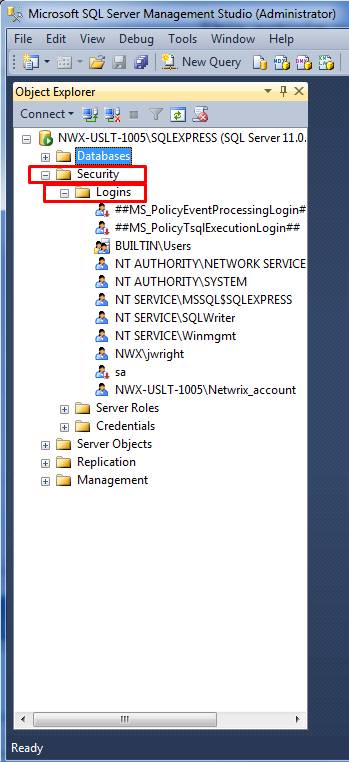
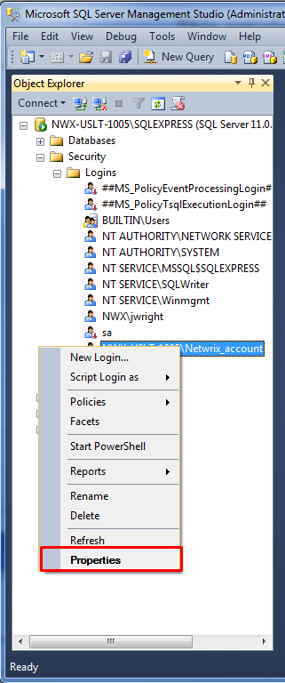
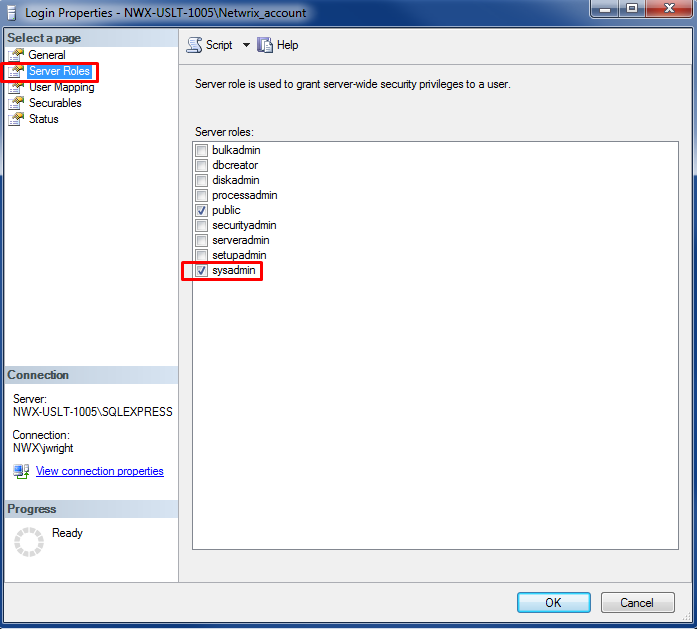

# Database contains tables not compatible with the product

Your audited system fails with the following error:

```
Error saving history to database: Database %name of database%
already contains tables that are not compatible with the product
```

---

Database permissions for the Data Processing Account are not sufficient. The Data Processing Account must either be a Sysadmin or have `DB_Owner` permission to each Netwrix database in order to upload audit data to the reporting database.

---

## Resolution

Using SQL Management Studio give the Data Processing Account `DB_Owner` rights to the Netwrix Auditor database in question.

1) Log into the instance which contains the product database using SQL Management Studio with a **sysadmin account**.

2) Expand **Security** and then **Logins**.  
   

3) **Right click** the **Data Processing Account** and go to **Properties** (add the account if it doesn't exist).  
   

4) Under **Server Roles** you can give **sysadmin** to this account OR alternatively you can go to **User Mapping** and select each Netwrix database individually and add **DB_Owner** permissions.  
   
