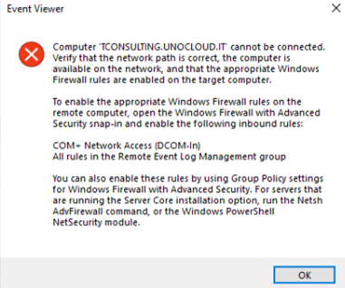

# Error 0x800706BA − RPC Server Is Unavailable

## Symptoms

The following warnings are prompted in Netwrix Auditor Health Log:

```text
Failed to process DC: %domain_controller_name%.
Failed to connect to remote service control manager. Error details: The RPC server is unavailable.
(Exception from HRESULT: 0x800706BA).
Make sure that you have administrative privileges, and the Windows Management Instrumentation (WMI) service is running on the target server.
```

```text
Failed to open the event log.
The RPC server is unavailable.
```

```text
The RPC server is too busy to complete this operation
```

```text
The following error occurred when analyzing changes for server %server%:
Agent operation failed due to the following error:
Failed to update the agent on the following server: %server%
```

## Causes

- Errors resolving a DNS or NetBIOS name.
- The RPC service or related services may not be running.
- Network connectivity issues.
- File and printer sharing is not enabled.
- TLS 1.2 is not set up.
- Insufficient server resources.

## Resolutions

- Configure firewall policies.

  **NOTE:** If you are using Windows Firewall, open the **Group Policy Object Editor** snap-in (`gpedit.msc`) to edit the Group Policy object (GPO) used to manage Windows Firewall settings in your organization. Navigate to **Configuration** > **Administrative Templates** > **Network** > **Network Connections** > **Windows Firewall**, and open either **Domain Profile** or **Standard Profile**, depending on which profile you are using. Enable the following exceptions:

  - Allow Remote Administration Exception
  - Allow File and Printer Sharing Exception

- Review the hostname and IP address. Verify the machine is turned on and reachable. Also make sure the FQDN is resolving to the correct IP address.

- Verify that the **Windows Management Instrumentation** service is running and set to auto-start after restart.

  > **NOTE:** If you see the following error in the Event Viewer while checking **Event Viewer (Local)** connection to another computer, enable inbound rules (COM+ Network Access and all rules in the Remote Event Log Management group) on the target computer. Refer to the following article for additional information: Configuration − Logon Activity Ports: Configure Windows Firewall Inbound Connection Rules ⸱ v10.6.
  >
  > 
  >
  > Learn more in: 0x80004027 error when you try to remotely access COM+ object after you upgrade to Windows Server 2016 or later versions ⸱ Microsoft

  For additional information on Windows Firewall configuration, refer to: Logon Activity Ports — Configure Windows Firewall Inbound Connection Rules · v10.6.

- Verify that the **TCP/IP NetBIOS Helper** service is running and is set to auto-start after restart.

- Verify the **Remote Procedure Call (RPC)** service is running and set to auto start after restart.

  To check event logs on the target domain controller:

  1. Log on to the computer where Netwrix Auditor is installed using the Netwrix data processing account.
  2. Go to **Start > Run** and type `eventvwr`, then click **OK**.
  3. Right-click **Event Viewer (Local)** and select **Connect To Another Computer**.
  4. In the **Select Computer** dialog window, type the name of the domain controller reporting the error in the **Another Computer** entry field. Click **OK** to connect to the domain controller.
  5. Select the **Security** log. The list should show valid event entries.

  Learn more in: Windows Server Troubleshooting: RPC server is unavailable ⸱ Microsoft

- Enable TLS 1.2. For additional information, refer to: Сonnection Issue when TLS 1.2 Is Required.

- RPC connections might be affected due to insufficient hardware resources. Review the hardware resources of the affected server to possibly increase the resource pool. Learn more in: Server Hardware Performance Considerations ⸱ Microsoft

## Related articles

- Configuration – Logon Activity Ports: Configure Windows Firewall Inbound Connection Rules ⸱ v10.6
- [0x80004027 error when you try to remotely access COM+ object after you upgrade to Windows Server 2016 or later versions ⸱ Microsoft](https://learn.microsoft.com/en-us/troubleshoot/windows-server/application-management/0x80004027-remotely-access-com-plus-object)
- Logon Activity Ports — Configure Windows Firewall Inbound Connection Rules · v10.6
- [Windows Server Troubleshooting: RPC server is unavailable ⸱ Microsoft](https://social.technet.microsoft.com/wiki/contents/articles/4494.windows-server-troubleshooting-rpc-server-is-unavailable.aspx)
- Сonnection Issue when TLS 1.2 Is Required
- [Server Hardware Performance Considerations ⸱ Microsoft](https://learn.microsoft.com/en-us/windows-server/administration/performance-tuning/hardware/)
