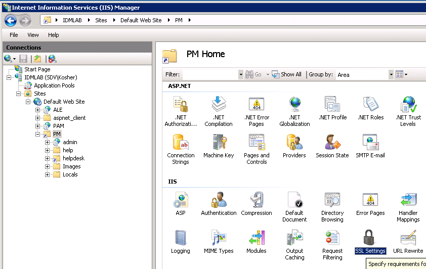
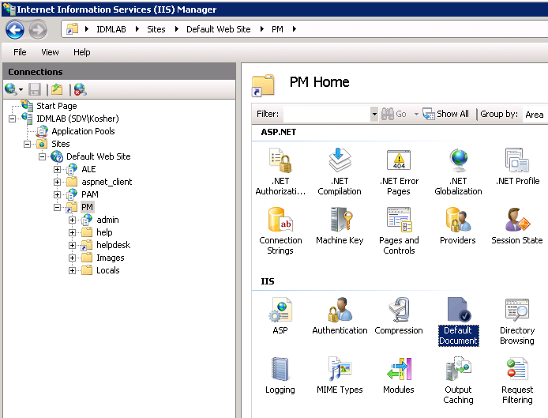
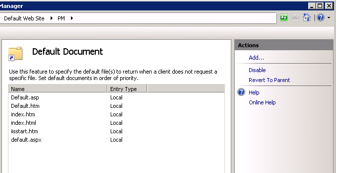

# Error 403

When trying to browse to any portal, you get "Error 403 - Access is denied"

The 403 error can be caused by several reasons. The most common reasons are:

1. You are trying to access the site via HTTP when HTTPs is required.  
   To enable access via regular HTTP make sure that **Require SSL** check-box is not enabled.

   1. Launch the **IIS Manager**
   2. Navigate to the **PM** virtual directory (Default Web Site/PM by default).
   3. In the central pane double-click **SSL Settings**
   4. Check settings, change if necessary

   

   

2. Default document IIS feature is not enabled.

   To check this:

   1. Launch the **IIS Manager**
   2. Navigate to the **PM** virtual directory (Default Web Site/PM by default).
   3. In the central pane double-click **Default Document**
   4. In the right pane click **Enable** (if there is no Enable option there, but **Disable** is, it means that the feature is enabled)

   

   
