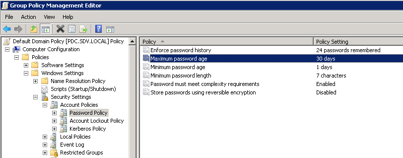

# Error: The "Maximum Password Age" is not set

Netwrix Password Reset returns the following error instead of sending notifications:

```
Failed to obtain password expiration settings for the domain. The "Maximum Password Age" setting is not specified for the domain.
```

Netwrix Password Reset uses the Maximum Password Age value from the Password policy to determine the password expiration date. If the Maximum Password Age is not defined or set to 0 (for example, in the case of a Fine Grained password policy in the domain), then Netwrix Password Reset is not able to determine the password expiration date and returns the above error. Netwrix Password Reset is not able to work in mixed mode; it can either use the default general Maximum Password Age policy, or a Fine Grained policy.

---

There are two ways to solve this issue:

1. Enable the **Only report users with Fine Grained Policy settings** option in the Netwrix Password Reset (PEN) monitoring plan. Note that this will make the product only report users who are affected by Fine Grained policies and ignore those who are not.
2. Configure the Maximum Password Age policy in the domain.

To set the Maximum Password Age policy for the domain:

1. Launch **Group Policy Management**
2. Edit the appropriate GPO (for example, Default Domain Policy)
3. Navigate to **Computer Configuration - Policies - Windows settings - Security settings - Account policies - Password policies**
4. In the right pane define the **Maximum password age** value
5. Update policies, for example run `gpupdate /force`


