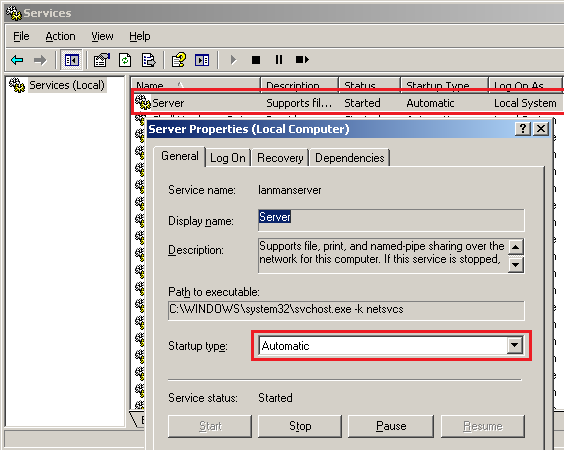
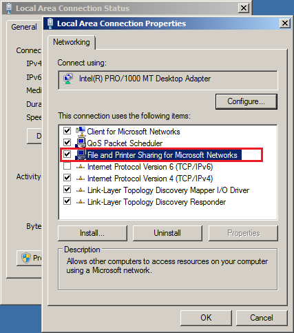
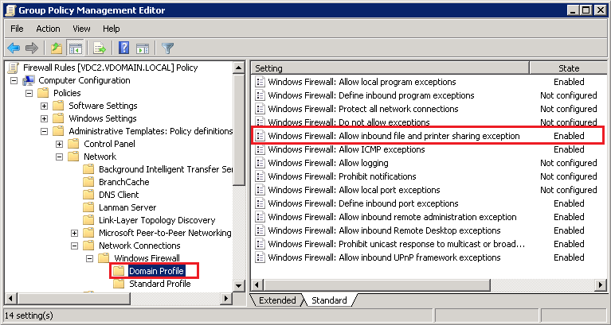

# Failed to open log

The following error appears in the Event Log Manager (ELM) - Summary Report:

ERROR: Failed to open log "Log Type" (API used: NT). Error details: The network path was not found. (Error number: 0x80070035)"

---

This error usually appears when ELM is configured to collect event logs without agent services (i.e. network traffic compression option is turned off).  
There are several possible reasons for this error to appear:

1. The problematic server is turned off or not accessible through the network.
2. The **Server** service is stopped on the problematic server.
3. The **File & Printer Sharing for Microsoft Networks** feature is turned off in the Local Area Connection properties.
4. The remote connection is blocked by **Windows Firewall**.

---

## Resolution

1. Make sure the problematic server is started and is accessible through the network.
2. Make sure the **Server** service is started and set to **Automatic** on the problematic server.

3. Make sure the **File and Printer Sharing for Microsoft Networks** component is enabled in the Local Area Connection properties.

4. Disable the **Windows Firewall** service on the problematic server:

- Launch the **Services** snap-in (Click Start / Run, type `services.msc` and press Enter).
- Locate the **Windows Firewall** service, stop it and set to Disable.

Or configure the Windows Firewall exception:

- Launch the **Group Policy Object Editor** snap-in (`gpedit.msc`) to edit the Group Policy object (GPO) that is used to manage the Windows Firewall settings in your organization.
- Expand nodes as follow: `Computer Configuration / Administrative Templates / Network / Network Connections / Windows Firewall`, and then open either Domain Profile or Standard Profile, depending on which profile you want to configure.
- Enable the **Allow inbound file and printer sharing exception** exception.

