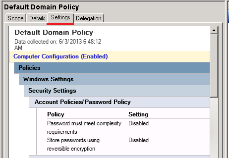
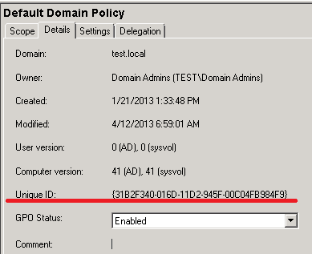

# Group Policy error: is not in a valid format

You may receive a Group Policy daily summary email with the error: "The file `DC01.corp.<MyDomain>.com\sysvol\corp.<MyDomain>.com\Policies\{31B2F340-016D-11D2-945F-00C04FB984F9}\Machine\registry.pol` is not in a valid format. The file might be corrupt. Use Group Policy Object Editor to reconfigure the settings in this extension."

---

The group policy is corrupted or it is not in a valid format. If you open the Group Policy Management Console (GPMC) > highlight the group policy in Summary and navigate to > **Settings** tab, most likely it will return you an error message.  

---

## Identify the affected GPO

First of all you need to find out the affected policy.

In the error message `"DC01.corp.<MyDomain>.com\sysvol\corp.<MyDomain>.com\Policies\{31B2F340-016D-11D2-945F-00C04FB984F9}\Machine\registry.pol"` — `31B2F340-016D-11D2-945F-00C04FB984F9` is the GUID of the affected group policy. To find out the GUID of a group policy open GPMC > highlight a group policy and open **Details** tab > **Unique ID** is the GUID of a GPO.  

There are 3 possible solutions:

1. If you receive an error in the GPMC > GPO **Settings** you may need to restore it from a backup or create anew.
2. This error may also appear when you enable the **Certificate Services Client "Certificate Enrollment Policy"** policy. Please refer to the following Microsoft article regarding this issue - http://support.microsoft.com/kb/2028605
3. Restore default domain GPOs from backup. Log on to any domain controller > open command prompt and type: `dcgpofix /target:contoso.com` (replace `contoso.com` with your domain name) For more information please refer to the following article - http://technet.microsoft.com/en-us/library/cc739095(v=ws.10).aspx  
   NOTE: This solution is intended for use only as a last-resort disaster-recovery tool. The customer settings will be reset.
4. If you have any Antivirus software installed on the affected domain controller please check the Virus scanning recommendations for Enterprise computers - http://www.netwrix.com/kb/1585
5. You may also omit the errors. To do that please open the file `omitproplist_gp.txt` located in the Netwrix Auditor installation folder and put the following to the file in a new line:  
   `*The file * is not in a valid format and must be replaced.*`  
   If you didn't find a solution please refer to the following Microsoft article regarding this issue - http://support.microsoft.com/kb/814751

 

