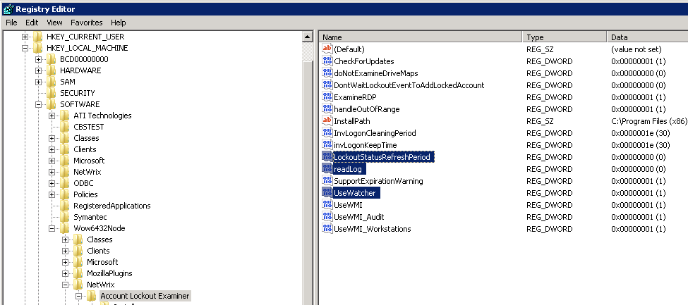

# High CPU load and memory usage

Account Lockout Examiner Service causes high CPU spikes and uses up a large percent of memory. What can I do?

## Resolution

In order to reduce CPU load and memory usage, perform the following steps:

1. Open the **Registry Editor** (navigate to **Start** → **Run** and type `regedit`).
2. Navigate to `HKEY_LOCAL_MACHINESOFTWARE[Wow6432Node]NetWrixAccount Lockout Examiner` (Wow6432Node only for x64 OS)
3. Locate the `Readlog` key and set its value to `0`.
4. Create a new key called `UseWatcher`, set its type to `DWORD` and value to `1`.
5. Restart the **NetWrix Account Lockout Examiner** service via **Services.msc**.

If this does not help, set the `LockoutStatusRefreshPeriod` key value to `0`, but in this case the Account Lockout Examiner will not verify accounts status via Active Directory, so account lockouts will not be reported if a corresponding event is not found in the event log.

