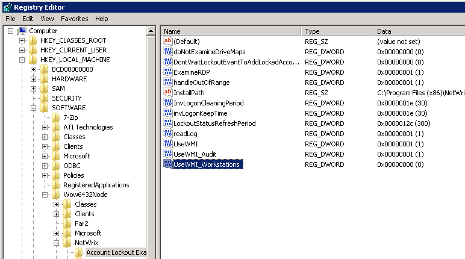

# High CPU usage on remote desktop servers

After installing Account Lockout Examiner (ALE), remote desktop servers can experience increased CPU usage by the `wmiprsve.exe` process. This behavior has been traced to WMI calls originating from the server running ALE. If you stop the Netwrix Account Lockout Examiner service while the CPU is loaded, CPU usage is reduced immediately.

## Cause

ALE tracks lockout events and invalid logon events from the Windows security log of specified domain controllers (DCs). When ALE collects an invalid logon event from a DC, it connects to the machine where the invalid logon originated and searches that machine's security log. By default ALE uses the WMI service to connect to security logs.

Every invalid logon event on a DC initiates a WMI query to the workstation or server where that logon occurred. If many invalid logons target the same machine, the resulting numerous WMI calls can drive up CPU usage on that machine.

## Resolution

There are two options you can use to reduce CPU usage.

### Option 1 — Switch the method ALE uses to connect to security logs

When you switch the method, ALE stops using the WMI service and uses a .NET-based mechanism instead. This change typically reduces CPU usage on the remote servers, but it may increase CPU usage on the machine running ALE.

To change this on the machine where ALE is installed:

1. Run Registry Editor (`regedit`).
2. Go to `HKLMSoftware[Wow6432Node]NetWrixAccount Lockout Examiner (Wow6432Node only for x64 OS)`
3. Change the `UseWMI_Workstations` value to `0`.
4. Restart the Netwrix Account Lockout Examiner service via `Services.msc`.

### Option 2 — Disable searching for detailed info about invalid logons

If Option 1 does not sufficiently reduce CPU usage, you can disable ALE's attempt to search for detailed information about invalid logons on workstations and servers. With this setting, ALE will only use domain controllers as the information source. Note that you will not see the name of the process that caused the invalid logon.

To change this on the machine where ALE is installed:

1. Run Registry Editor (`regedit`).
2. Go to `HKLMSoftware[Wow6432Node]NetWrixAccount Lockout Examiner (Wow6432Node only for x64 OS)`.
3. Create a new DWORD called `PF_Enabled` and set its value to `0`.
4. Restart the Netwrix Account Lockout Examiner service via `Services.msc`.

