# How do I migrate the Reporting database to another MS SQL Server instance lower version?

How do I migrate the Reporting databases to another MS SQL Server instance of a downgraded version?

There are a few options to downgrade the database from a higher version of SQL Server to a lower version of SQL Server. These options include:

- Configure the product to the destination SQL Server, create the product database, and upload all historical data to it from the local repository folder with the Netwrix Auditor DB Importer tool (can be found in the product installation folder, by default: `C:Program Files (x86)NetwrixActive Directory Auditing`);  

- Migrate the database with the **Generate Scripts** wizard of SQL Server Management Studio. For it please perform the following steps:

1. Script the schema of the database on the source SQL Server instance using the **Generate Scripts** wizard of the SQL Server Management Studio interface.

1.1 In Object Explorer connect to the SQL server, right-click the database, expand **Tasks** and choose **Generate Scripts**.

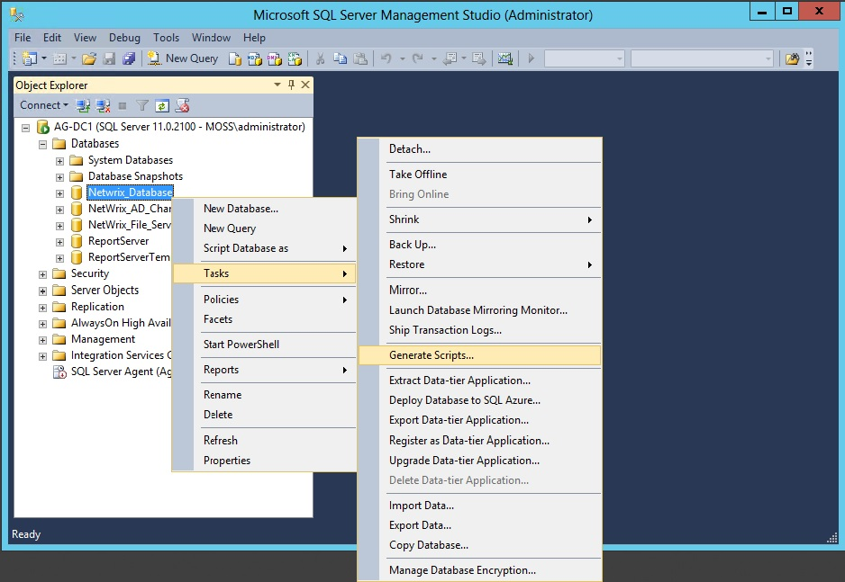

1.2 This launches the **Generate and Publish Scripts** wizard. Click **Next** to skip the Introduction screen and proceed to the Choose Objects page.

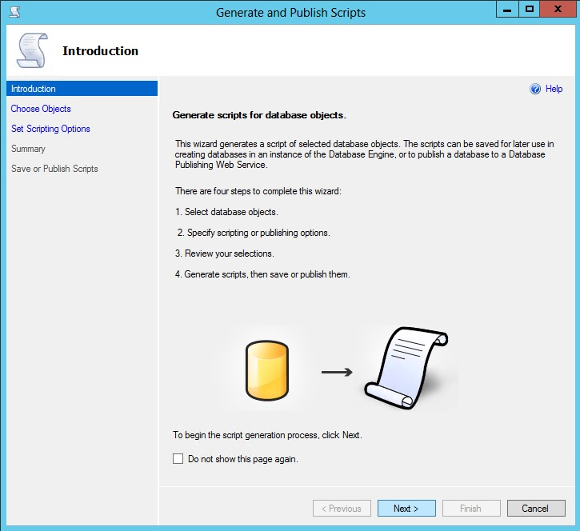

1.3 On the Choose Objects page, choose **Script entire database and all database objects**, and then click **Next** to proceed to the **Set Scripting Options** page.

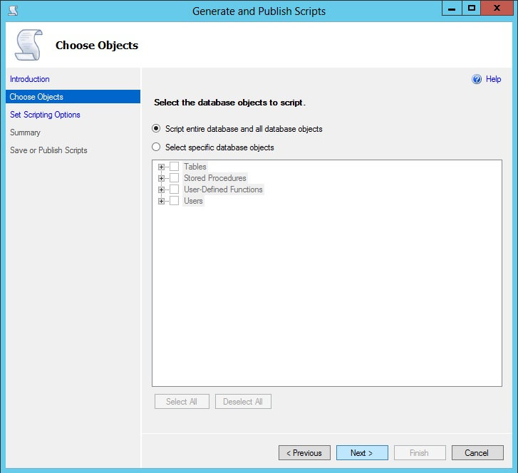

1.4 On the **Set Scripting Options** page, specify the location where you want to save the script file, and then click the **Advanced** button.

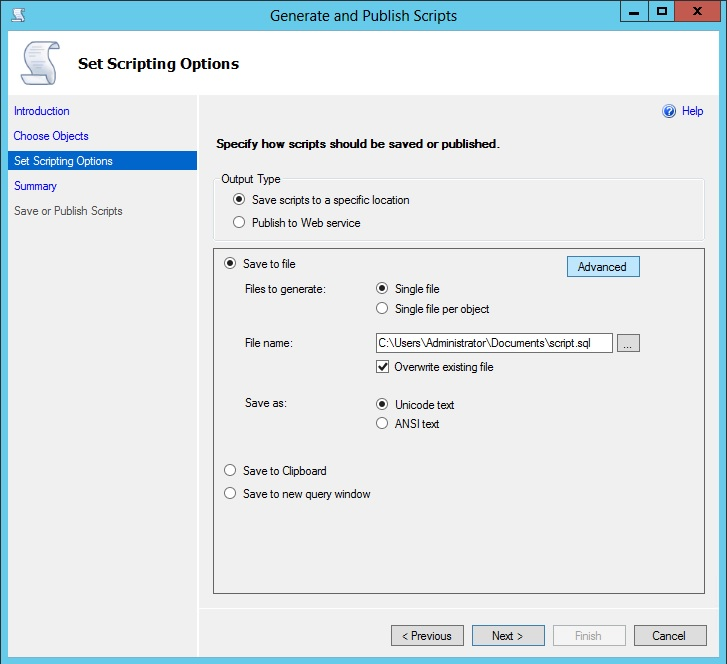

1.5 In the **Advanced Scripting Options** dialog box, set `Script Triggers`, `Indexes` and `Primary Key` options to `True`, set `Script for Server Version` to ``&lt;version of the destination SQL server instance&gt;``, and set `Types of data to script` to `Schema and Data`. This last option is key because this is what generates the data per table.

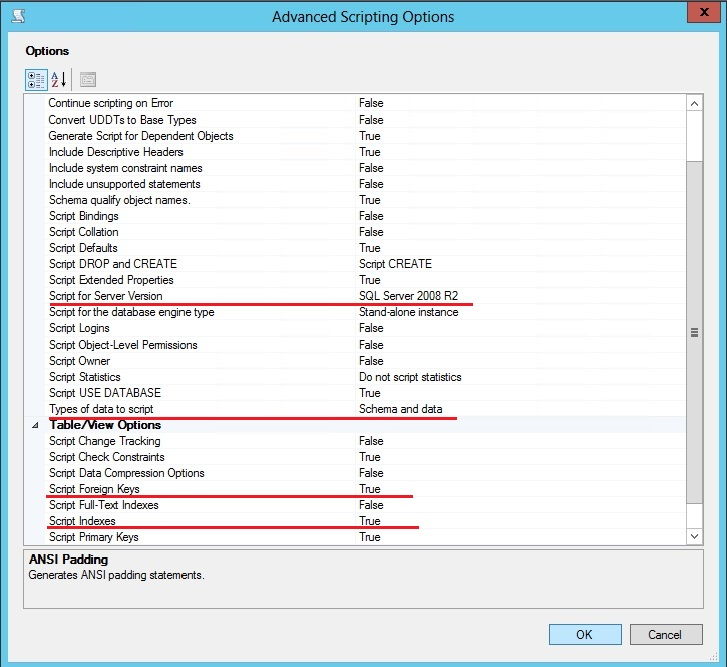

1.6 Once done, click **OK** to close the **Advanced Scripting Options** dialog box and return to the **Set Scripting Options** page. In the **Set Scripting Options** page, click **Next** to continue to the Summary page.

1.7 After reviewing your selections on the Summary page, click **Next** to generate scripts.

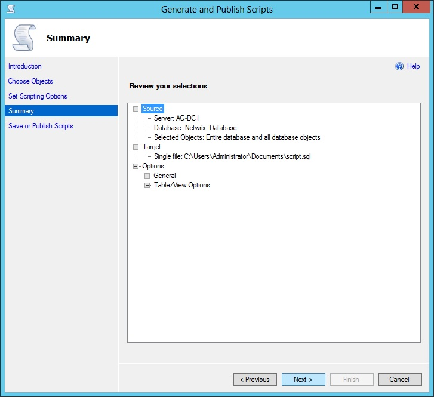

1.8 Once scripts are generated successfully, choose the **Finish** button to close the **Generate and Publish Scripts** wizard.

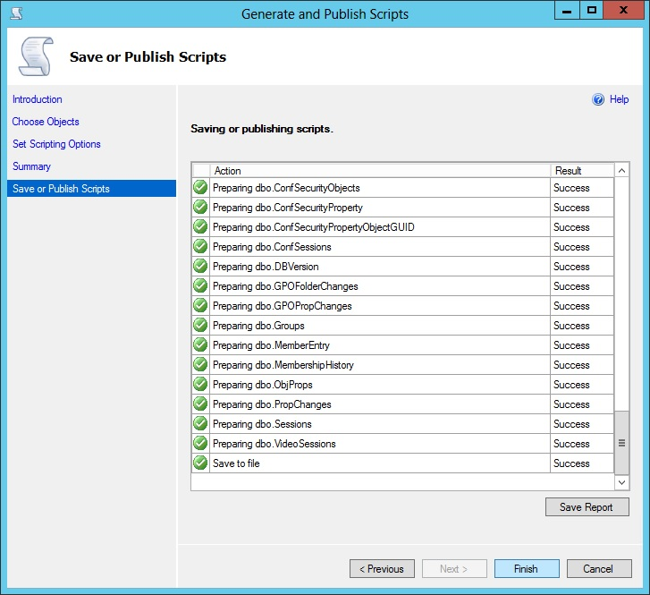

2. Connect to the destination SQL Server instance, and then run the SQL scripts that were generated, to create the database schema and copy its data.

2.1 In Object Explorer connect to the destination SQL Server instance and then in SQL Server Management Studio open the SQL Server script you saved in Step 1.

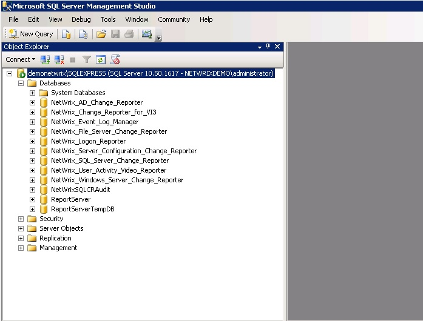

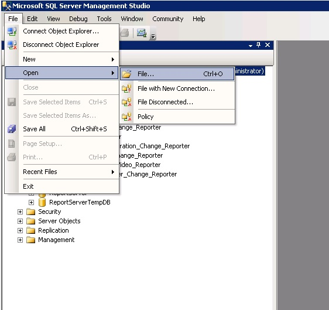

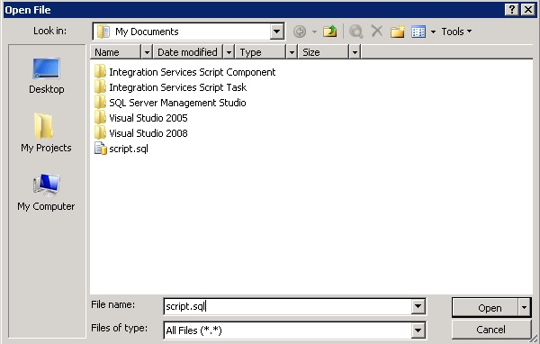

2.2 Modify the script to specify the correct location for the database data and log files. Once done, run the script to create the database on the destination SQL Server instance.

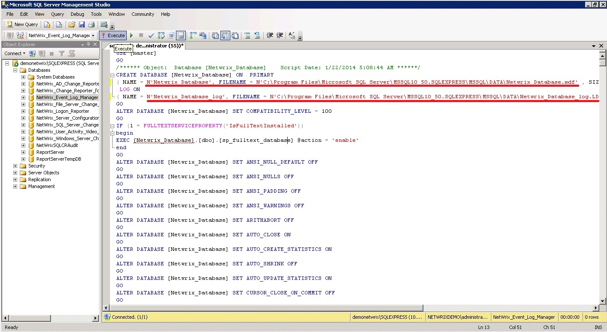

2.3 Upon successful execution, refresh the Database folder in Object Explorer.

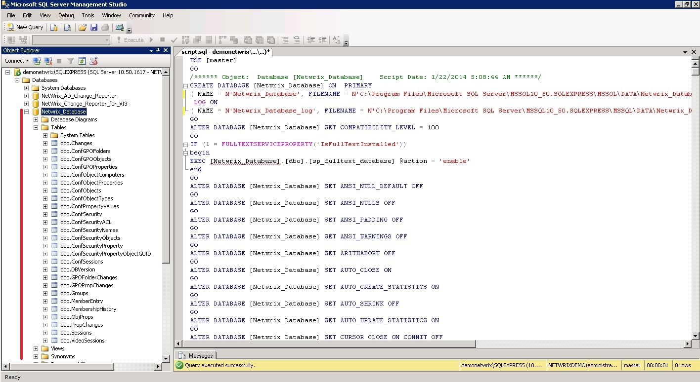
