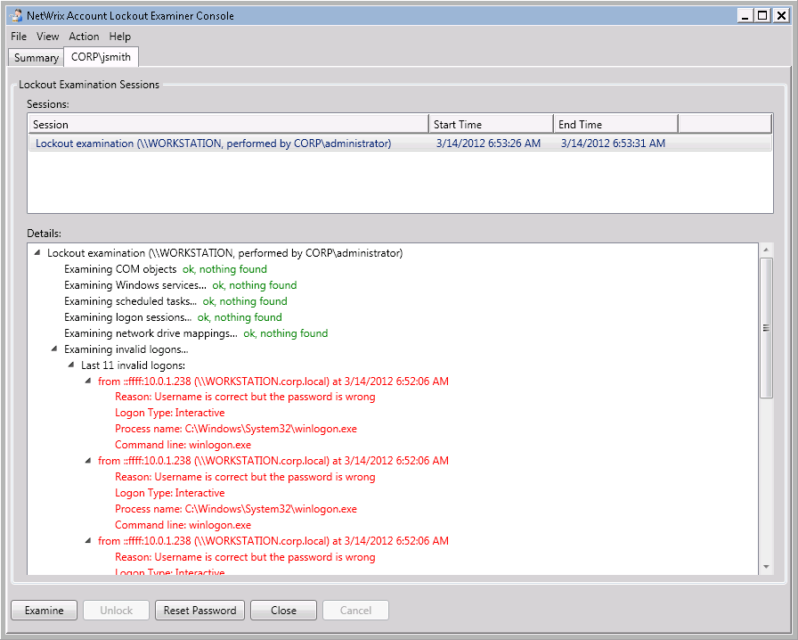

# How does Netwrix Account Lockout Examiner work

## Overview

Netwrix Account Lockout Examiner tracks account lockouts in real time, enables proactive lockout resolutions, and helps you effectively troubleshoot account lockouts.

Account Lockout Examiner is able to determine the origins of lockouts and show detailed information about specified lockouts and invalid logons. Account Lockout Examiner processes Windows Security log without using agents, so you must configure the audit policy in the domain according to the requirements of the tool. Configuration of the audit policy is described in the admin guide and this [article](http://kb.netwrix.com/1199).

Since Windows Security log is the only source, Account Lockout Examiner can show only the information that is present in the log. After Account Lockout Examiner finds a lockout event, it adds the information about the account lockout to the list in the **Summary** tab. You can investigate an account lockout using the **Examination** feature.

### Conducting an Examination

To run an examination:

1. Click the **Examine** button at the bottom of the list in the **Summary** tab, or
2. Right-click an account and select **Examine**.

When you run an examination, it shows a list of invalid logons, specifies the names of the processes that used invalid credentials, and checks the most common reasons for lockouts: mapped drives, scheduled tasks, RDP sessions, and services running under the credentials of the account in question. Examination results look like this: 
