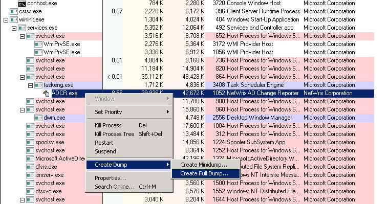

# How to create the full dump of a process

Netwrix technical support may ask you to create a dump of a particular process (it records the memory state of the product at specific time). Perform the following steps to create a dump file:

1. Download the Process Explorer using the following link: [http://download.sysinternals.com/files/ProcessExplorer.zip](http://download.sysinternals.com/files/ProcessExplorer.zip).
2. Extract the `ProcessExplorer.zip`.
3. Run the `procexp.exe` application.
4. Navigate to required process, right-click it and select **Create Dump > Create Full Dump.**
5. Specify location to save the dump file.
6. Provide the dump file to the technical support.

**NOTE:** If you receive Access Denied error during the process, please check the ["Debug Programs" Computer Policy](https://docs.microsoft.com/en-us/windows/security/threat-protection/security-policy-settings/debug-programs). Consider adding the account that you use to the list of allowed users or use an Account which has this permission (e.g. local administrator account)"
