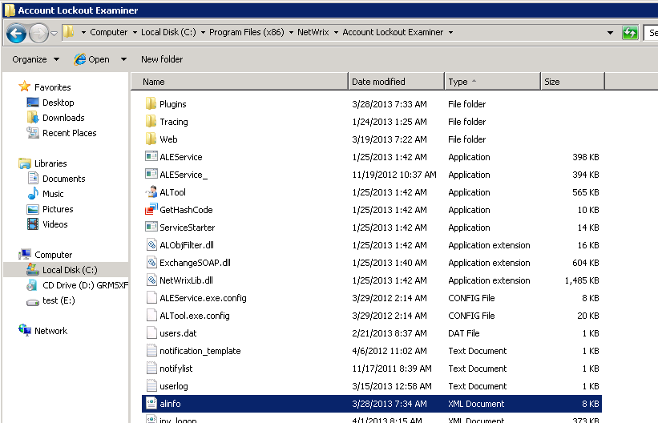

# How to delete old entries from the account list

You can delete old entries by selecting the accounts from **All accounts** (multiple selection is supported) and clicking the **Remove** button.

The account list is stored in the `alinfo.xml` file and you can manually delete the required accounts directly from the file. To do this, stop the Netwrix Auditor service, delete the account information (the information is enclosed in the `<ALObj>` and `</ALObj>` tags; accounts are referred to as `SIDs`), and then start the service again.

1. Stop the Netwrix Auditor service.
2. Open the `alinfo.xml` file.
3. Delete the account information enclosed in the `<ALObj>` and `</ALObj>` tags for the accounts you want to remove. Accounts are referred to as `SIDs`.
4. Save the `alinfo.xml` file.
5. Start the Netwrix Auditor service.

