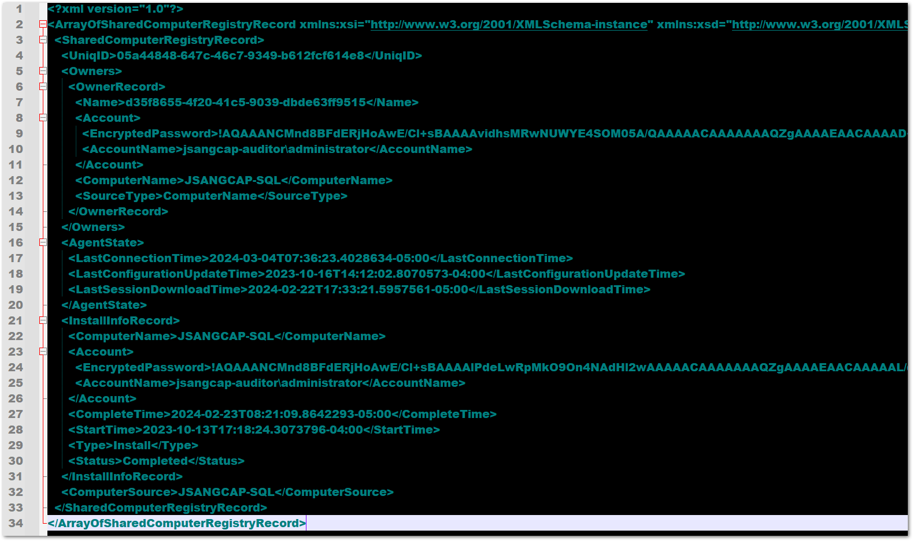

# How to Exclude Non-operable Domain Controllers from Monitoring in Netwrix Auditor

## Question

How to exclude a non-operable or decommissioned domain controller from monitoring?

## Answer

To exclude domain controllers from monitoring, refer to the following steps:

1. Navigate to the ` %Working Folder%`.

   The default path to Netwrix Working Folder is: `C:\ProgramData\Netwrix Auditor`. If the Working Folder has been moved and you do not know the path, you can find it by opening the **Registry Editor** and navigating to:

   `Computer\HKEY_LOCAL_MACHINE\SOFTWARE\WOW6432Node\Netwrix Auditor\DataPathOverride`

   > **NOTE:** The `Inactive Users Tracker` folder might not exist in the `%working folder%` directory if Inactive Users Tracker was not deployed.

2. Open the `omitdclist.txt` file and specify the name of the domain controller you want to exclude in a new line.

   > **NOTE:** Make sure the line does not start with the **#** symbol.

   Refer to the following code block for a reference:

   ```text
   # DC name formats: full DNS and NETBIOS. IP addresses are not supported.
   # e.g. # dc1.example.com
   #
   MYDC.MYDOMAIN.LOCAL
   ```

   

3. Save the changes. Inactive User Tracker will exclude this domain controller.

Refer to the following article for additional information: Monitoring Plans — User Activity Monitoring Scope — v10.6.
