# How to figure out the IP address used for a failed logon attempt?

There is no **IP address** field in the `Failed Logon Attempts` report.

However there are 2 ways you can figure out the IP address:

1. Locate the event and review the event data. To do this, refer to **Procedure 1**.  
2. Enable the "**Write event descriptions into the database**" option. To do this, refer to **Procedure 2**.

## Procedure 1:

1. Note the **Computer** **name** and the timestamp of the particular failed logon attempt.

   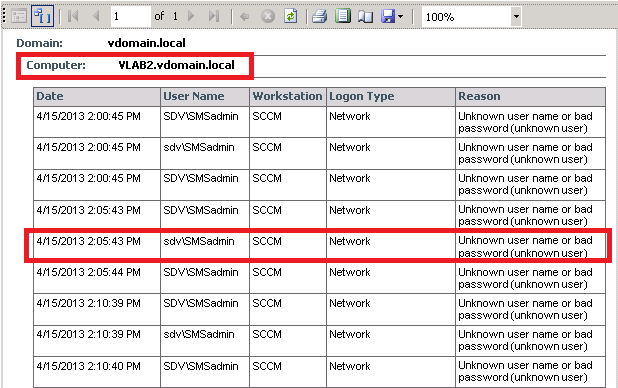

2. Go to **Start / All Programs / Netwrix Auditor / Event Log Manager / Advanced Tools / Viewer**
3. In the **Viewer** tool:
   - select **Managed Object** name from the drop-down list
   - select **Computer**, that you have noticed on step 1 as **Computer name**
   - select **Event Log** as **Security**
   - specify dates **From** and **To**, use date from the timestamp that you have noticed on step 1

   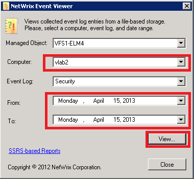

4. Click the **View** button, and specify the location of the evt-file and click **OK**. The newly saved event log will be opened in **Event Viewer** automatically.
5. To convert the evt-file to evtx format, in the left hand panel, right click the saved log and select **Save All Events As**, specify the location of the evtx-file and click **OK**. Open the saved file via **Event Viewer**.

   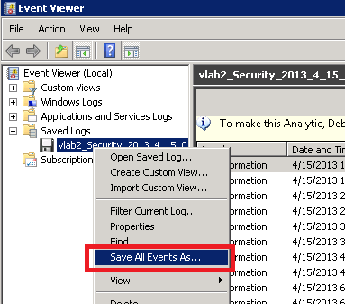

6. When the evtx-file is opened, click **Filter Current Log** in the **Actions** pane.
7. In the **Filter Current Log** dialog box, specify `Event ID` as `4625,529-537,539` (failed logon attempts IDs), and then click **Logged** drop-down list and select **Custom range**.

   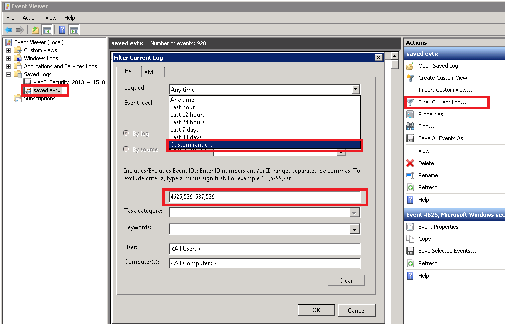

8. Specify date range around the timestamp that you have noticed on step 1 and click **OK**. Click **OK**

   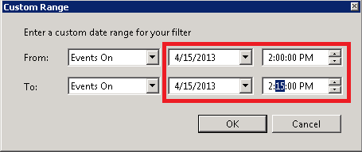

9. Find the corresponding event in the filtered log and double-click it.
10. The **IP Address** is displayed in the **Network Information** section of the event description.

    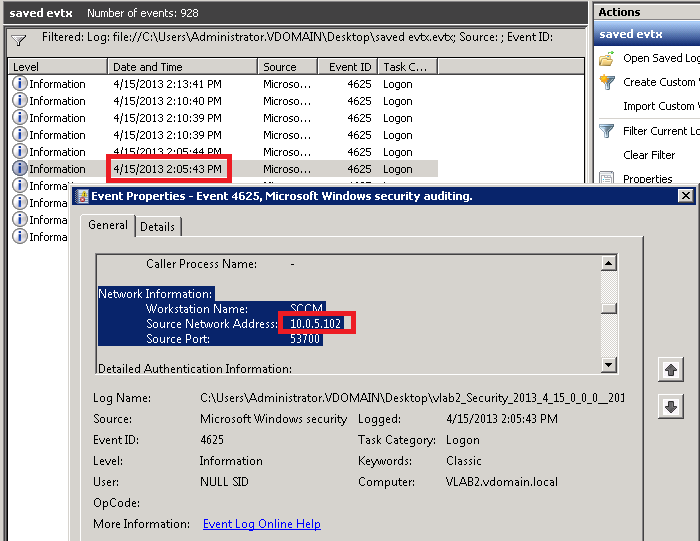

## Procedure 2:

1. Note the **Computer name** and the timestamp of the particular failed logon attempt.

   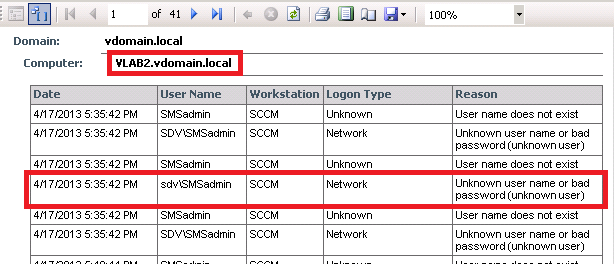

2. In the **Netwrix Auditor Management Console**, go to **Managed Objects / &lt;Your Mananaged Object&gt; / Event Log Manager** node.
3. Enable the "**Write event descriptions into the database**" check box (if it is already selected, continue from **step 6**). Close console.

   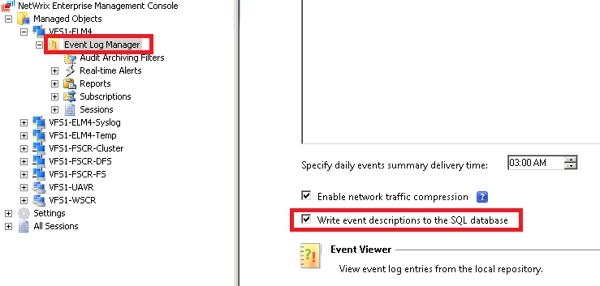

4. Go to **Start / All Programs / Netwrix Auditor / Event Log Manager / Advanced Tools / DB Importer**
5. Select your managed object from the drop-down list and specify the date range that includes the date of the event. Click **Import**.

   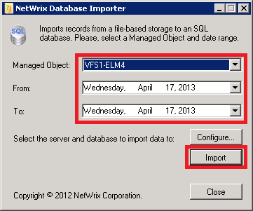

6. Start **Netwrix Auditor Management Console**, go to **Managed Objects / &lt;Your Mananaged Object&gt; / Event Log Manager / Reports / General Reports / All Events by Computer** report.
7. In the filters:
   - specify date range around the timestamp that you have noticed on step 1
   - specify **Computer** as **Computer name** you have noticed on step 1 (put **%** before and after the name)
   - specify **Event ID** as **%5%**
   - specify **Event Log** as **Security**

   !" 

8. Click the **View Report** button.
9. Find the corresponding event in the filtered log and click the blue link in the **Date** field.

   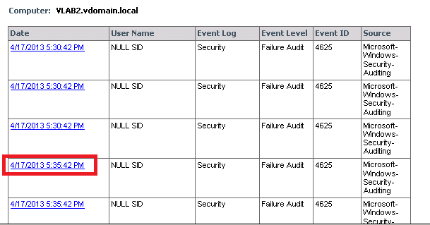

10. The page with **Event Details** will be displayed.

    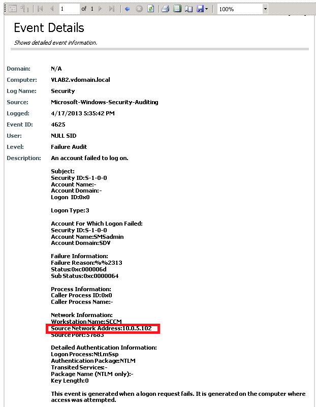

NOTE:

- The **IP address** is not always available in the description of the **Failed logon attempt** events.
- If you are looking for full description for another event, the described steps are similar except the specified **Event IDs** will be different.
