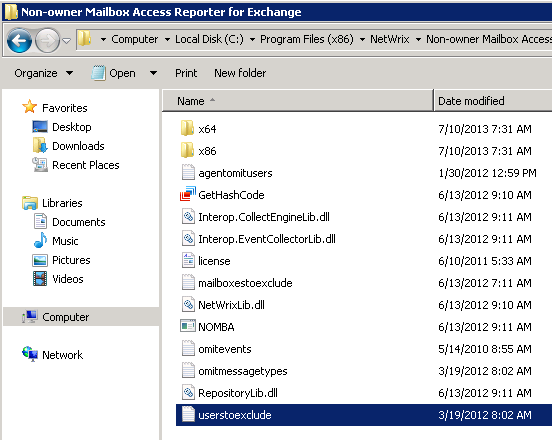

# How to filter out certain users from reports

How do I filter out certain users from mailbox access reports?

## Procedure

1. To exclude a specific user from the mailbox access reports, add that user to the `userstoexclude.txt` file located in the Netwrix Auditor installation directory.
   - Since this file is read at the beginning of each data collection, the exclusion affects only newly collected data.

## File structure

- Each entry must be on a separate line.
- Wildcards (`*` and `?`) are supported.
- Lines that start with the `#` sign are treated as comments and are ignored.

## Image

## Note

**NOTE.** The `userstoexclude.txt` file contains a list of users who must be excluded from reports if they perform non-owner access to mailboxes. But the audit data for these users will still be stored in the snapshots, so if a user is removed from this list, the information on the user actions can be viewed with the **Report Viewer**.
