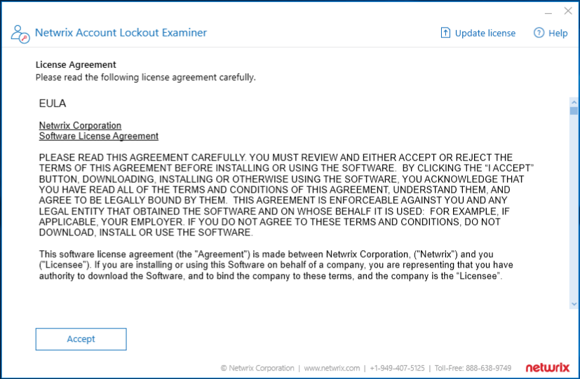

# How to Install and Use Netwrix Account Lockout Examiner

## Preparation
Ensure you have downloaded the most recent version of Netwrix Account Lockout Examiner (ALE). Navigate to [https://www.netwrix.com/my_products.html](https://www.netwrix.com/my_products.html) to download the most recent version of ALE, as well as other Netwrix products.

## Launching Netwrix Account Lockout Examiner
Once you've downloaded ALE, open the folder. Here you will find the following items:

- Netwrix Account Lockout Examiner executable
- Netwrix Account Lockout Examiner User Guide
- What's New!

1. Right click the `Netwrix_Account_Lockout_Examiner.exe` and click **Run as Administrator**.
2. A window will appear with a License Agreement and EULA. Please read the contents carefully and then choose to **Accept**.

## Operating Netwrix Account Lockout Examiner
The next page that appears the the starting page for ALE. Here is a brief description of the options available to you.

- **Locked account name -** This filed is where you will enter the account you wish to examine to discover the source of being locked out.

- **Specify examiner credentials** - The first radial button is selected by default - the **"Use current account"** option. This option will use the currently logged in account as the service account to conduct the examination. If you would like to provide another account, choose the second radial button - the **"Use the following account"** option. **Ensure the account is a member of the Domain Admins group.**

- **Examine audit trails for the last X days** - This field accepts a numeric value which will determine how many days backward the examiner will look while parsing security event logs. The further back the examination goes, the longer the examination process will take.

Once the fields above are satisfied, click the **Examine** button to begin an examination.

For continued use of ALE, save the executable to a location such as the desktop. If at anytime you wish to begin a new examination, simply re-run the executable.
