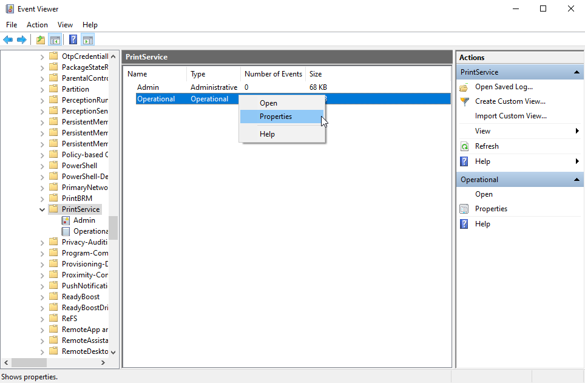
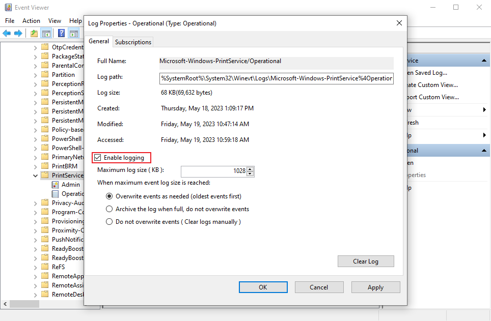
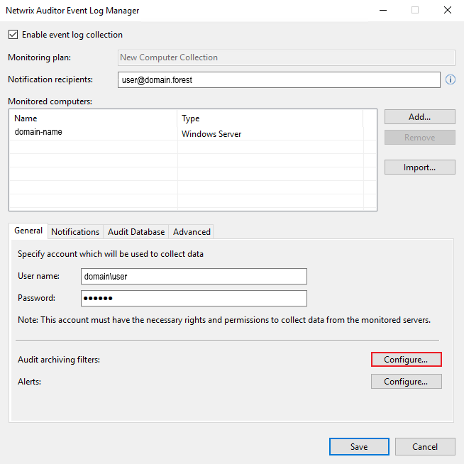
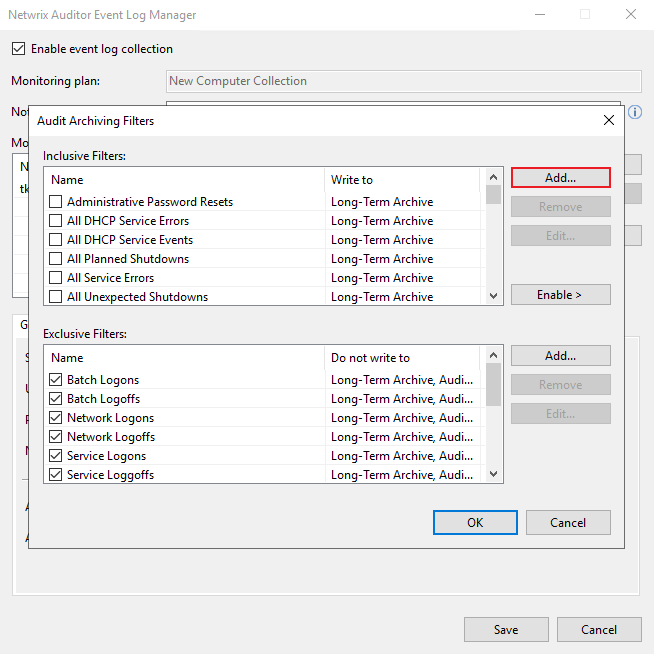
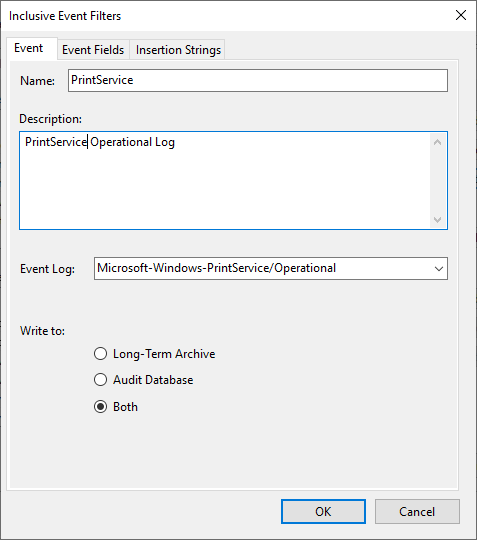
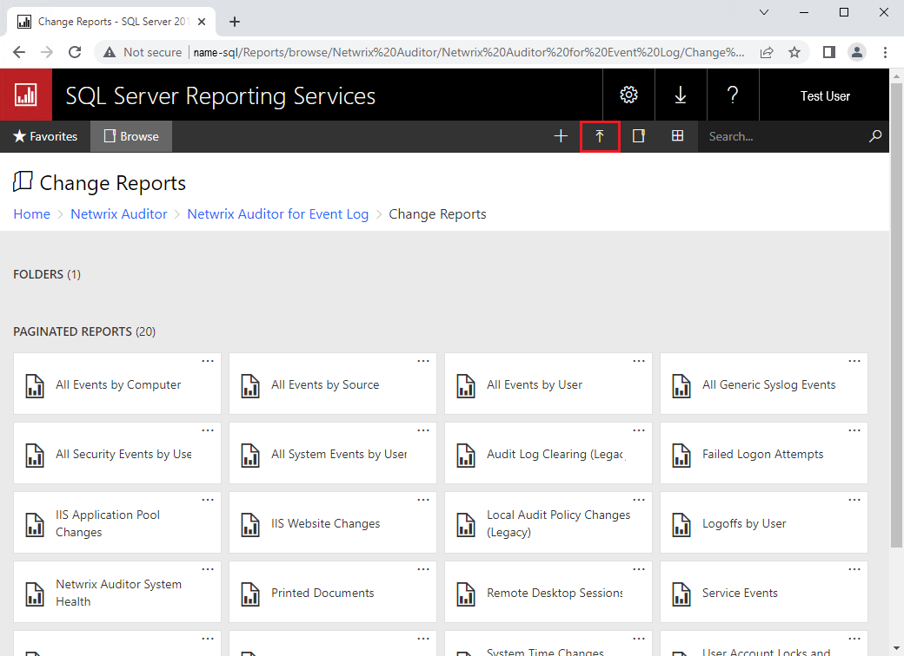
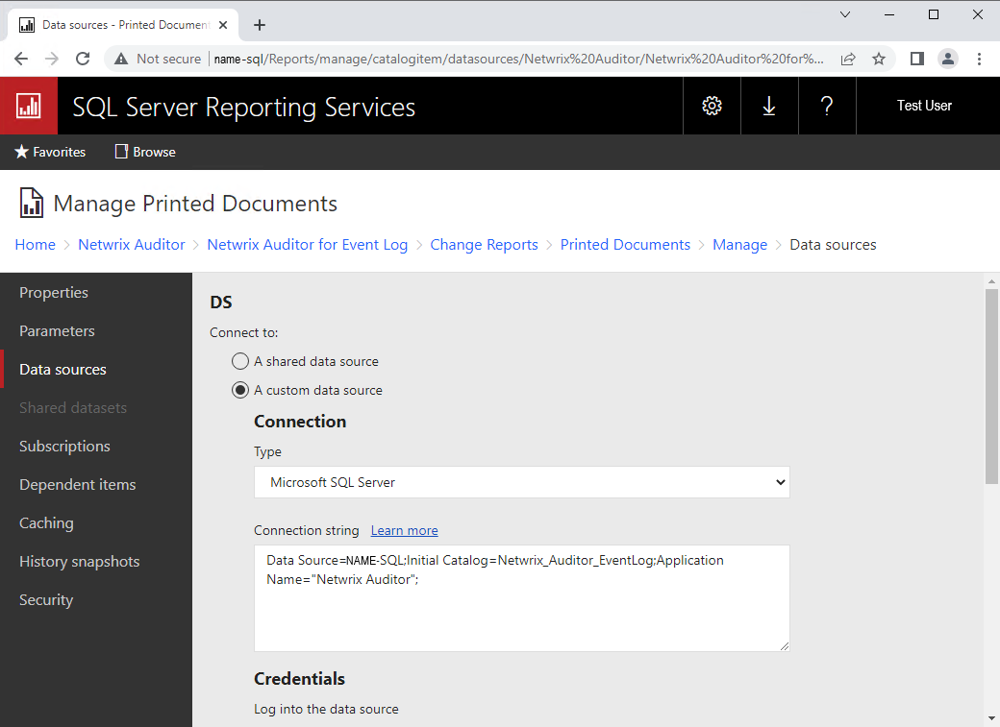
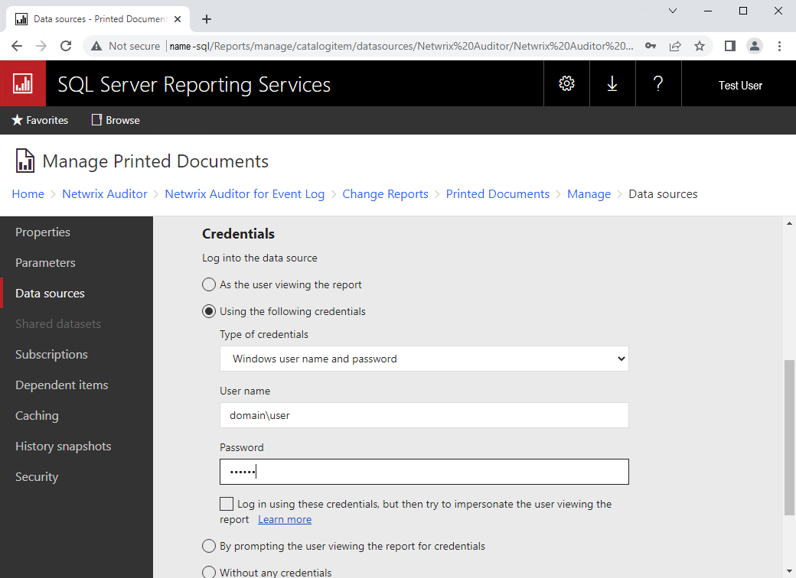
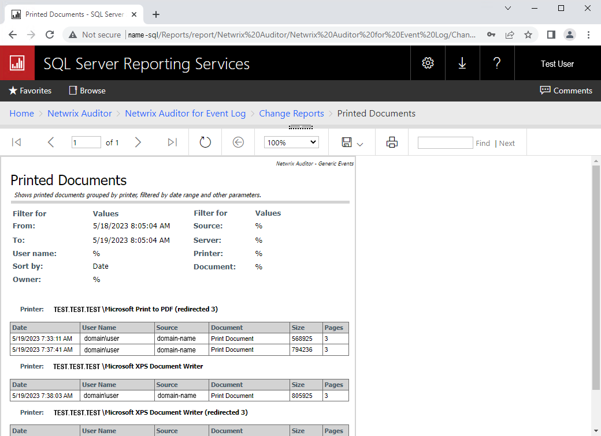

# How to Monitor Print Service Activity

## Question
How to track print usage statistics for a network printer?

## Answer
You can enable the print event logging by following the steps below:

1. Enable logging for the print service of the print server — open **Event Viewer** > **Applications and Services Logs** > **Microsoft** > **Windows** > **PrintService**.
2. Right-click the **Operational** item to select **Properties**.

   

3. Check the **Enable logging** checkbox — print service events will now be logged. Click **OK** to save changes.

   

Create an inclusive filter in Netwrix Auditor Event Log Manager:

1. Create a new monitoring plan by clicking **Add** or select the preexisting monitoring plan and click **Edit**.
2. Click the **Configure** button for Audit archiving filters.

   

3. Click **Add** for Inclusive Filters.

   

4. Fill in the filter name and description with the **Event Log** field to contain the following line:

   ```
   Microsoft-Windows-PrintService/Operational
   ```

   Verify the location for the print server event logs via Event Viewer — the Log Name should correspond with the actual event logs location.

   

5. You can specify Event IDs in the **Event Fields** tab to filter the events (e.g. Event ID 307 for **Printing a document**). Additionally you can filter the events via **Insertion Strings**, refer to the index numbers specified in event details (e.g. Param1 stands for Index 1 with "Job #" value).

Download the **Printed Documents RDL.zip** archive provided below and extract the .rdl file:

1. Open the Reports Server URL in your browser and navigate to the folder you'd like to upload the report to (e.g. **Home** > **Netwrix Auditor** > **Netwrix Auditor for Event Log** > **Change Reports**).
2. Click **Upload** to upload the report to the folder.

   

Configure the report to use the `Netwrix_Auditor_EventLog` database:

1. Click the meatball **More info** menu of the Print Service report to select the **Manage** tab.
2. Select the **Data sources** tab to choose **Custom data source**.
3. Specify the Microsoft SQL Server connection type and enter the following connection string:

   ```
   Data Source=SQLINSTANCE;Initial Catalog=Netwrix_Auditor_EventLog;Application Name="Netwrix Auditor";
   ```

   NOTE: `SQLINSTANCE` should be replaced with the name of your SQL Server instance.

   

4. Input your credentials, test the connection and save the changes.

   

5. The report is now available via the web interface of your Report Server. It will not appear under Reports in the Netwrix Auditor console.

   

Printed Documents RDL: https://www.netwrix.com/download/Printed-Documents-RDL.zip
