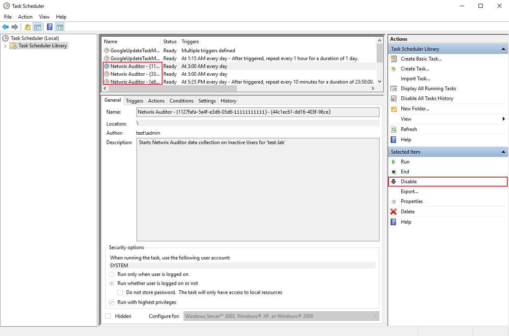

# How to Move Long-Term Archive to a New Location

## Question

How to move Long-Term Archive to a location different from the default one for Netwrix Auditor version 8.5 and newer?

## Answer

> **NOTE:** In case you've previously migrated your Netwrix Auditor Storages (Long-Term Archive and/or Short-Term Archive) manually or upgraded from Netwrix Auditor 8.0, contact [Netwrix Technical Support](https://www.netwrix.com/support.html) for assistance.

For a clean installation of Netwrix Auditor 8.5 or newer, follow these steps:

1. Stop all services except `Netwrix Auditor Configuration Service(NwCfgServerSvc)` and `Netwrix Auditor Core Service(NwCoreSvc)`.
   - If any monitoring plan for **Netwrix Password Reset**, Inactive User Tracker, or Event Log Manager has ever been set up, disable the scheduled tasks for these applications of your Netwrix Auditor instance. To disable them:
     - Navigate to **Start** > **All Programs** > **Task Scheduler** > **Task Scheduler Library** and locate the tasks named Netwrix Auditor with descriptions mentioning the Netwrix Password Reset, Inactive User Tracker, or Event Log Manager applications.
     - Select these tasks (if any) and click **Disable** in the right pane.
     
     

2. Copy all files from the old Long-Term-Archive folder into the new Long-Term-Archive folder except for the `ActivityRecords` folder.

   > **TIP:** While it is not recommended to store your Long-Term Archive on a system disk or in a remote location, it is still possible to set both options up. Refer to the following article for additional documentation on setting up remote Long-Term Archive: Auditor Settings – Long-Term Archive · v10.6.

3. Copy the very last day folder from your `ActivityRecords` folder.
   - Pay attention to the folder structure — if the very last day folder had the `C:\ProgramData\Netwrix Auditor\Data\ActivityRecords\1970\01\01\0000` path, it should be copied to `%New_LTA_Path%\ActivityRecords\1970\01\01\0000`.

4. Start `Netwrix Auditor Management Service(NwManagementSvc)`. In the main Netwrix Auditor menu, navigate to **Settings** > **Long-Term Archive** and specify the new path.

5. Start the other services and tasks you previously disabled.

6. Copy the rest of the files from the old `ActivityRecords` folder to the new one. If you are prompted to overwrite any files, skip those files instead.
