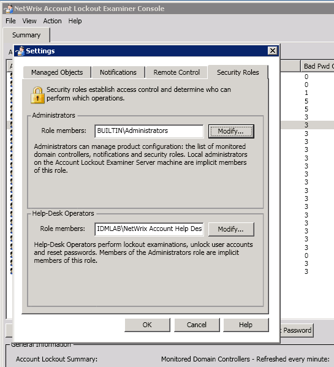

# How to restrict access to the Help-Desk portal and the Administrative Console

## Overview

Netwrix Account Lockout Examiner uses a role-based security model that allows assigning different access permissions to users with different roles. The product uses two roles:

- **Administrator**: has complete access to all product features, including the configuration options in the Administrative Console.
- **Help-Desk Operator**: can unlock user accounts and reset passwords, and perform account lockout examinations from the Administrative Console or the Help-Desk portal. Members of this role cannot modify the product settings.

By default, the **Administrator** role includes users belonging to the local `Administrators` group on the computer where Netwrix Account Lockout Examiner is installed; and the **Help-Desk Operator** role includes users belonging to `Netwrix Account Help Desk` group in the domain where Netwrix Account Lockout Examiner is installed.

## To include or exclude users from these security groups

1. In the Netwrix Account Lockout Examiner console, navigate to **File -> Settings** and select the **Security Roles** tab.
2. Click the **Modify** button next to the group that you want to edit.
3. In the dialog that opens, click **Add** to add a member to the selected security role, or select a user and click **Remove** to exclude them.

