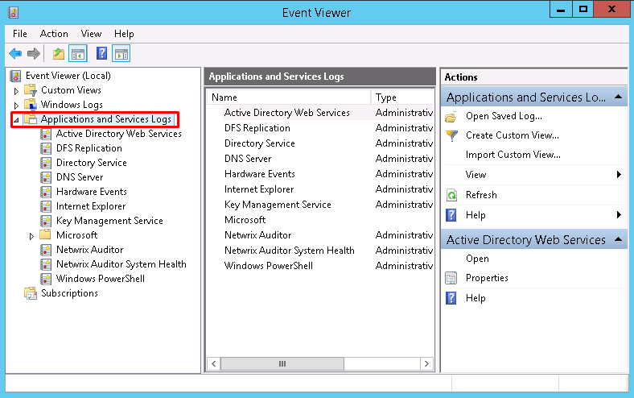
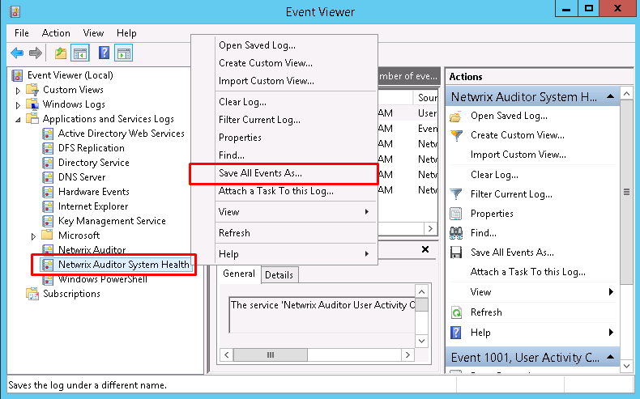

# How to Save and Zip Netwrix Auditor System Health Event Log

## Question

How to save (export) and zip the Netwrix Auditor System Health event log?

## Answer

### Export System Health event log via elevated Command Prompt line

Execute the following command in an elevated Command Prompt:

```
wevtutil epl "Netwrix Auditor" %userprofile%\desktop\NASH.evtx
```

The exported System Health event log will appear on your Desktop.

### Export System Health event log manually

1. Open **Event Viewer**.
2. Expand the **Applications and Services Logs** folder.

   

3. Right-click the **Netwrix Auditor System Health** log file and select **Save All Events As...**.
4. Name the file and click **Save**.

   

5. Select the option to **Display information for these languages**, check the **English (United States)** checkbox, and click **OK**.
6. Once the file is saved, right-click it and zip the file.

### Sending Netwrix Auditor logs

Your Technical Support Engineer may request you to attach Netwrix Auditor logs. Refer to the following article for additional information: https://kb.netwrix.com/4645 (How to Send Netwrix Auditor Logs).
