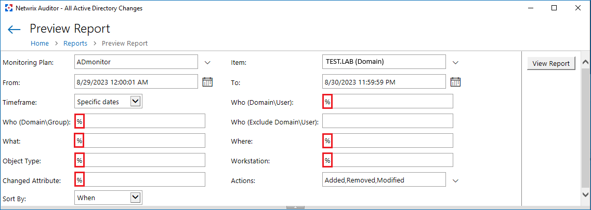

# How to Use Wildcards in Netwrix Auditor Reports

## Question

How to use wildcards in Netwrix Auditor reports? What are the wildcards?

## Answer

Netwrix Auditor reports are based on SQL Server Reporting Services — the same wildcards apply as the wildcards used in SQL queries.

### Wildcards

#### `%`
- Function: The `%` wildcard matches all characters beginning at that position and/or bounded by the next character. See results for the `A%E` query.
- Matched results:
  - `AE`
  - `ABE`
  - `ACE`
  - `ABCDE`

#### `_`
- Function: The `_` underscore wildcard replaces any single character at that position. See results for the `A_E` query.
- Matched results:
  - `A1E`
  - `ABE`
  - `AAE`
  - `AOE`

#### `[***]`
- Function: The `[***]` square brackets wildcard will match a single stated character at the position in the string. See results for the `A[ABC]E` query.
- Matched results:
  - `ABE`
  - `ACE`
  - `AAE`
  - Not `ADE`, `AEE`, etc.

#### `[*-*]`
- Function: The `[*-*]` square brackets wildcard will match a range of characters at that position in the string. See results for the `A[A-D]E` query.
- Matched results:
  - `ABE`
  - `ACE`
  - `AAE`
  - `ADE`
  - Not `AEE`, `AOE`, etc.

#### `[^*-*]`
- Function: The `[^*-*]` square brackets wildcard will match any character outside of the specified range. See results for the `A[^A-D]E` query.
- Matched results:
  - `ARE`
  - `AGE`
  - `AOE`
  - Not `ABE`, `ACE`, `AAE`, `ADE`.

