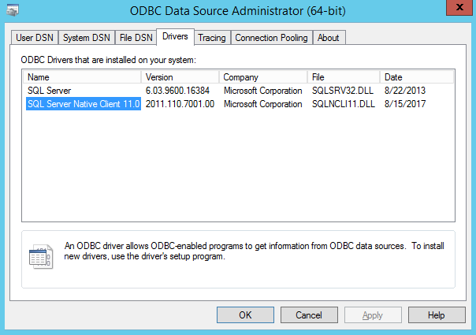

# How to Make Netwrix Auditor Upload Data to SQL Using TLS 1.2

## Overview

This KBA describes a process of configuring Netwrix and SQL Server to communicate via the secure channel - TLS version 1.2.

## Instructions

Here is an example of an error you may encounter while using the Search function in Netwrix Auditor:

```
Sql Server error occurred (18, [DBNETLIB][ConnectionOpen (SECDoClientHandshake().]SSL Security error.)
```


1. Make sure TLS 1.2 is enabled on both servers. Use this Microsoft guide to configure it: [How to enable TLS 1.2](https://docs.microsoft.com/en-us/mem/configmgr/core/plan-design/security/enable-tls-1-2).
2. To find the version of Native Client, start the ODBC Administrator on the Netwrix Auditor host. Right-click the **Start** button and then choose **Run**. In the Run window, type the following, followed by **Enter**: `odbcad32.exe`.
3. Check the Version column under the Drivers tab.

   

4. If the version is lower than "2011.110.7001.00", download and install the **64-bit version** of [SQL Native Client](https://www.microsoft.com/en-us/download/details.aspx?id=50402) on the Netwrix Auditor host.
5. Restart the **Netwrix Auditor Audit Archive Service**.

---

For more information about SQL and TLS 1.2, refer to [TLS 1.2 support for Microsoft SQL Server](https://support.microsoft.com/en-us/help/3135244/tls-1-2-support-for-microsoft-sql-server).