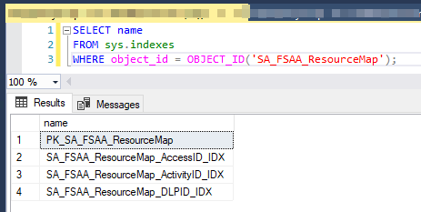

# Improving File System Bulk Import Performance by Adding Indexes in Netwrix Access Analyzer v12.0

## Related Queries

- "FSAA bulk import takes too long."
- "How do I speed up FSAA bulk import in Access Analyzer?"

## Overview

To enhance performance during File System Bulk Imports, you can add additional indexes to the `SA_FSAA_ResourceMap` table in the Netwrix Access Analyzer (formerly Enterprise Auditor) database. Internal testing has shown significant improvements in import efficiency when these indexes are present. This guide outlines the steps for adding them safely using **SQL Server Management Studio (SSMS)**.

> **NOTE:** This performance issue began in **Netwrix Access Analyzer v12.0** and has been **resolved in v12.0.0.1128**. Applying the indexes below is only necessary if you are using an earlier affected build. You can verify if the additional indexes are already present in your environment using the following SQL command:

```sql
SELECT name FROM sys.indexes WHERE object_id = OBJECT_ID('SA_FSAA_ResourceMap');
```

## Instructions

1. **Stop Any Running File System Bulk Imports**  
   Pause any active import jobs before applying index changes to prevent locking issues or partial writes. You can restart them once all indexes are successfully added.

2. **Launch SQL Server Management Studio (SSMS)**  
   Connect to your **Access Analyzer** database instance using an account with DBO privileges.

3. **Select the Correct Database**  
   In the **Object Explorer**, expand the appropriate server node. Then, locate and select the **Access Analyzer** database that contains the `SA_FSAA_ResourceMap` table.

4. **Open a New Query Window**  
   Right-click the selected database and choose **New Query** to open a new query editor tab.

5. **Run the Index Creation Statements**  
   Copy and execute the following SQL commands in the **Query** window:

```sql
CREATE INDEX SA_FSAA_ResourceMap_AccessID_IDX ON SA_FSAA_ResourceMap (HOST, AccessID);
CREATE INDEX SA_FSAA_ResourceMap_ActivityID_IDX ON SA_FSAA_ResourceMap (HOST, ActivityID);
CREATE INDEX SA_FSAA_ResourceMap_DLPID_IDX ON SA_FSAA_ResourceMap (HOST, DLPID);
```

6. **(Optional) Verify Index Creation**  
   To ensure the indexes were created, run the following query in the **Query** window:

```sql
SELECT name FROM sys.indexes WHERE object_id = OBJECT_ID('SA_FSAA_ResourceMap');
```



7. **Restart File System Bulk Imports**  
   Once indexes are confirmed, resume any imports that were previously paused.

> **NOTE:** These indexes only need to be applied once. Future versions of the **Create Schema** job will automatically detect them and skip creation if they already exist.

## Related Link

- [Create Schema Job Documentation](/docs/accessanalyzer/12.0/solutions/filesystem/collection/0-create_schema)