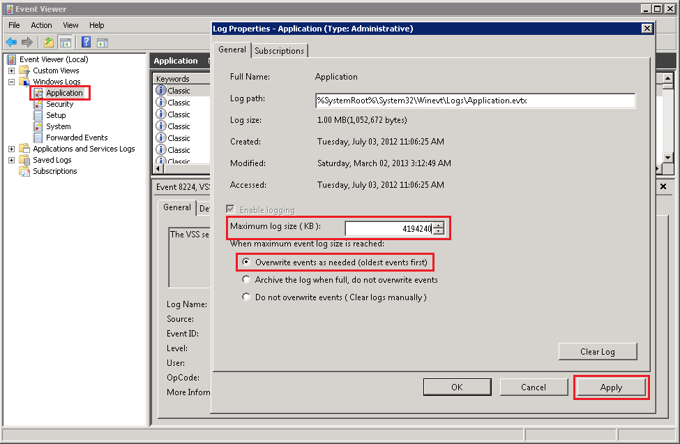
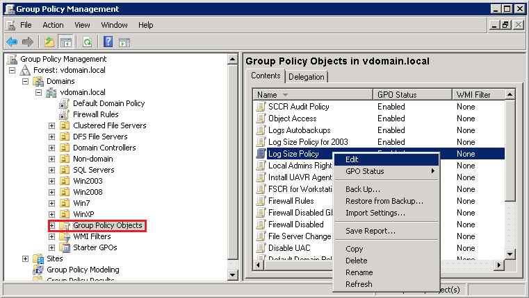
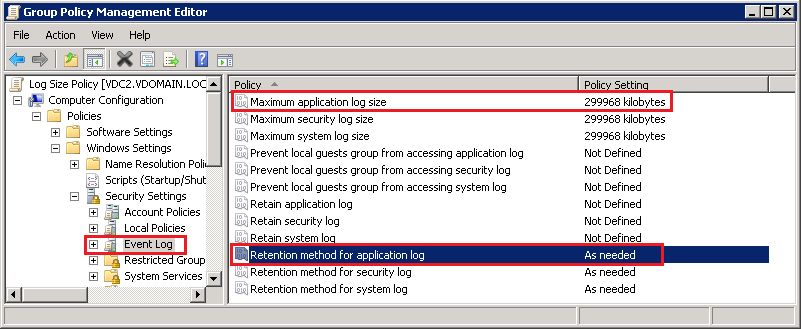
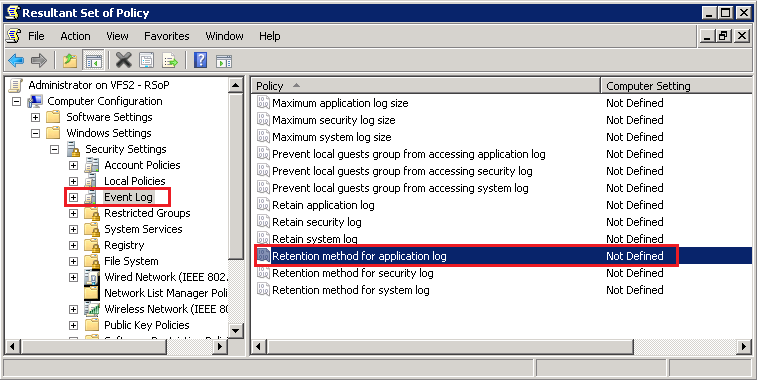
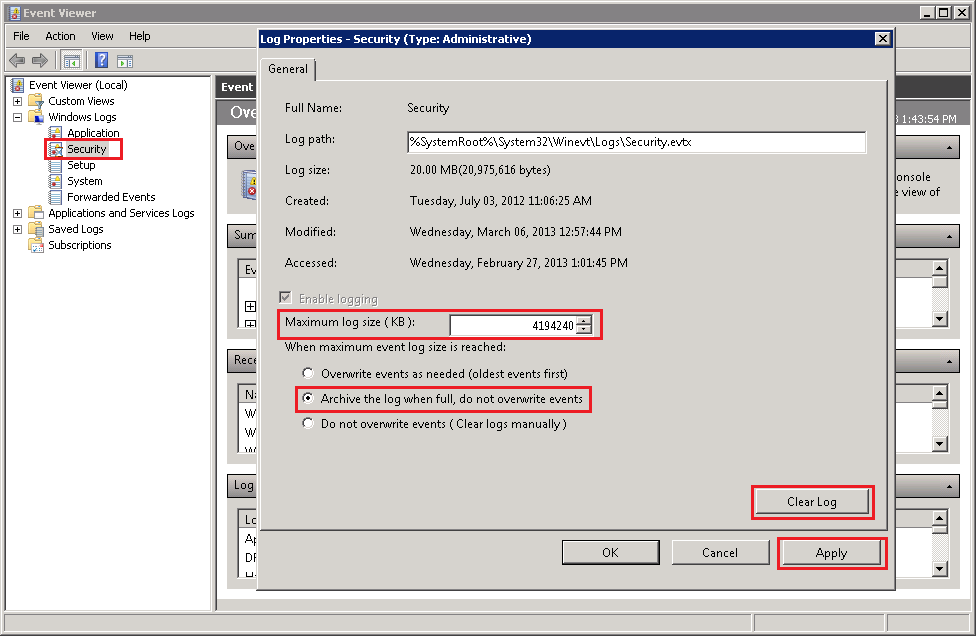
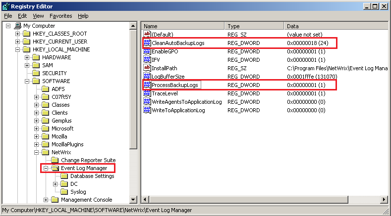

# Log overwrites warnings

**Netwrix Event Log Manager** shows the following errors:

```
[WARNING] <Event log name> log overwrites occurred on this computer since the last collection. Please increase the maximum size of the <Event log name>. Last collected event: 02/28/2013 18:23:14 (GMT); first new event: 02/28/2013 18:37:15 (GMT); estimated loss: 1 hour(s). Cannot find last stored event.
```

## Overview

The product is configured to collect the event data at the preconfigured intervals (every 10 minutes by default), but the real frequency of the data collections depends on the number of new events in the logs of monitored servers. If the target event log is configured to **Overwrite events as needed** and the `Maximum log size` of the event log does not allow keeping all events between the data collections, the program cannot find the last collected event in the target log and detects that some events were lost. There are several reasons why the error occurs:

## Possible causes

1. The target event log is configured to keep `20480 Kb` of events by default and that is not enough to keep all generated events between the data collections. Refer to **Procedure 1 and 2** to increase the maximum event log size.
2. The target event log has been cleaned up manually by the system administrator. In this case for **Application** log, you may see the following information in the warning message: **first new event: 01/01/1970 00:00:00 (GMT)**; (see example screenshot).

NOTE: for **Security** and **System** event logs, you can figure out who cleared the log if you can find the appropriate event in the log:

- **System** event log: "The System log file was cleared." event (**Event ID: 104**);"
- **Security** event log: "The audit log was cleared." event (**Event ID: 1102**);
- **Application** event log: there is no way to find out who cleaned up the **Application** event log.

3. The target event log overwrites events faster than the program collects them (often occurs with **Security** event log). Refer to **Procedure 3 and 4** to configure the problematic event log to **Archive events when full**.
4. The target event log is configured to **Archive events when full**, and **Event Log Manager** is not configured to process event logs archives. Refer to **Procedure 4** to configure Event Log Manager.

## Procedure 1: Increase `Maximum log size` on the problematic server

1. Log on to the problematic server and launch **Event Viewer**: Click **Start**, **Run** and type `eventvwr.msc` without quotes and press **Enter**.
2. In the left-hand panel of **Event Viewer**, navigate to the problematic log, and then right-click it and select **Properties**.
3. In the **Properties** window, change `Maximum log size` to `4194240` (Kb) as recommended by Microsoft: http://support.microsoft.com/kb/957662  
   IMPORTANT: Before changing `Maximum log size`, make sure that the system drive has enough free space to store the event log of the maximum size. If not, the event log will grow and fill up all free space on the system drive and the system will stop responding.
4. Make sure the **Overwrite events as needed** option is selected and click **Apply**.



## Procedure 2: Increase `Maximum log size` via Group Policy Object

1. Go to **Start** / **Administrative Tools** / **Group Policy Management**.
2. In the window displayed, go to **Group Policy Management** / **Forest Name** / **Domains** / **Group Policy Objects** / right-click the appropriate policy (or create new) and select **Edit**. **Group Policy Management Editor** starts.



3. In the left pane, go to **Computer Configuration** / **Policies** / **Windows Settings** / **Security Settings** / **Event Log**. Right-click **Retention method for `<problematic event log>`**, choose **Properties**.
4. In the **Security Policy Setting** tab, check the **Define this policy setting** box and select **Do not overwrite events (clear log manually)**. Click OK.
5. Right-click **Maximum `<problematic event log>` size**, choose **Properties**.
6. In the **Security Policy Setting** tab, check the **Define this policy setting** box and set the size to `4194240` Kb as recommended by Microsoft: http://support.microsoft.com/kb/957662  
   IMPORTANT: The affected machines must have enough free space on their system drives for storing the event log of the maximum size. If not, the event log will grow and fill up all free space on the system drive and the system will stop responding.



7. Close **Group Policy Object Editor** and link the configured GPO to the required OUs and containers in **Group Policy Management**.
8. OPTIONAL: Upgrade the group policies on the problematic servers by performing the following command:  
   ```
   gpupdate /force
   ```

## Procedure 3: Configure the problematic event log to **Archive events when full**

1. On the problematic server, click **Start** / **Run**, type `rsop.msc` and press **Enter**.
2. When the **Resultant Set of Policy** is processed, expand **Computer Configuration** / **Windows Setting** / **Security Settings** / **Event Log**.
3. Make sure that the **Retention method for `<problematic log>`** policy setting has the **Not Defined** or **Manually** value set. If not, change this setting using **Group Policy Management Editor** as described in **Procedure 2**.



4. Perform the following steps:
   - Click **Start** / **Run**, type `eventvwr.msc` and press **Enter**. The **Event Viewer** window will be displayed.
   - Expand the **Windows Log** node, right-click **Security** and select **Properties**.
   - In the **Maximum Log Size** field, set the following value: `4194240` (Kb).
   - Select the **Archive the log when full, do not overwrite events** radio button.
   - Click the **Clear Log** button. Click the **Apply** button.



NOTE: These maximum sizes are recommended by Microsoft: http://support.microsoft.com/kb/957662  
IMPORTANT: Before you change `Maximum log size` and enable the **Archive events when full** option, make sure that the system drive has enough free space to store the event log and log's backup files of the maximum size. If not, the event log will grow and fill up all free space on the system drive and the system will stop responding.

5. Perform the steps from **Procedure 4** to allow the product to collect and to clear the log's backup files.

## Procedure 4: Configuring event log's backup files processing

1. On the computer that has Netwrix software installed, Click **Start** / **Run**, type `regedit` and press **Enter**. The **Registry Editor** window will be displayed.
2. Expand `HKEY_LOCAL_MACHINE/SOFTWARE/NetWrix/` (`HKLM/Software/Wow6432Node/NetWrix/` for a 64-bit operating system) and click the **Event Log Manager** key.
3. Change the values of the following keys:

- `ProcessBackupLogs` set to `1`
- `CleanAutoBackupLogs` set to `X` (if you want the archives to be removed when all events in them are older than `X` hours, for example: `24` hours).


