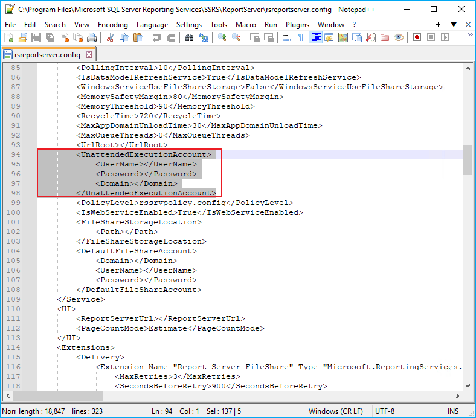

# Logon Failed for Unattended Execution Account Running Netwrix Auditor Reports

## Symptom

The following error occurs when trying to run Netwrix Auditor reports:

```text
The report server has encountered a configuration error.
Logon failed for the unattended execution account. (rsServerConfigurationError)
Log on failed. Ensure the user name and password are correct. (rsLogonFailed)
The user name or password is incorrect
```

## Causes

- Credentials for the execution account used in your Report Server Configuration Manager instance are incorrect.
- Incorrect credentials for an execution account are saved in the `rsreportserver.config` file and are prompted upon a login.

## Resolutions

To verify credentials for an execution account in Report Server Configuration Manager, follow these steps:

1. In the **Start** menu on your SQL server, select the **Microsoft SQL Server Reporting Services** folder > **Report Server Configuration Manager**.
2. Connect to the server.
3. In the left pane, select the **Execution Account** tab.
4. Review the credentials provided, and click **Apply**.

If no credentials are visible in Report Server Configuration Manager, follow these steps:

1. Locate the `rsreportserver.config` file. Refer to the following path for SQL Server Reporting Services (2016):

   ```text
   C:\Program Files\Microsoft SQL Server\MSRS13.MSSQLSERVER\Reporting Services\ReportServer
   ```

   Refer to the following path for SQL Server Reporting Services (2017 and later):

   ```text
   C:\Program Files\Microsoft SQL Server Reporting Services\SSRS\ReportServer
   ```

2. Open the `rsreportserver.config` file in a text editor, and locate the `<UnattendedExecutionAccount>` node.

   

3. Delete the credentials specified in `<UserName>`, `<Password>`, and `<Domain>` fields.
