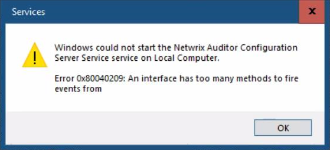
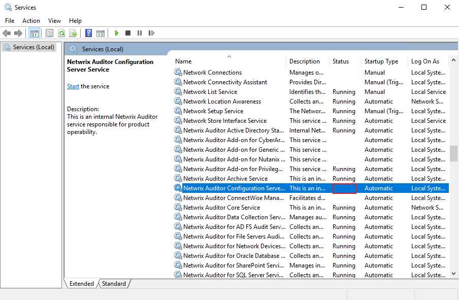
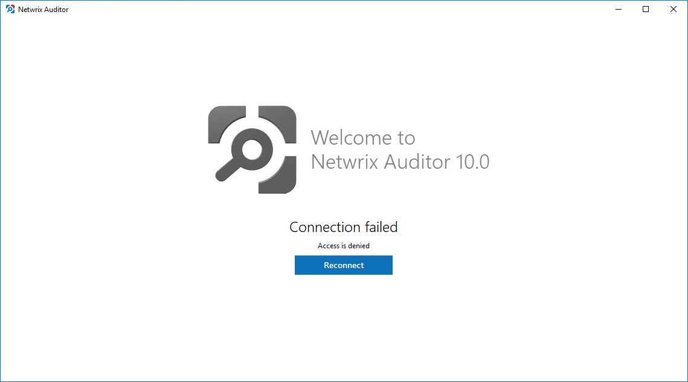
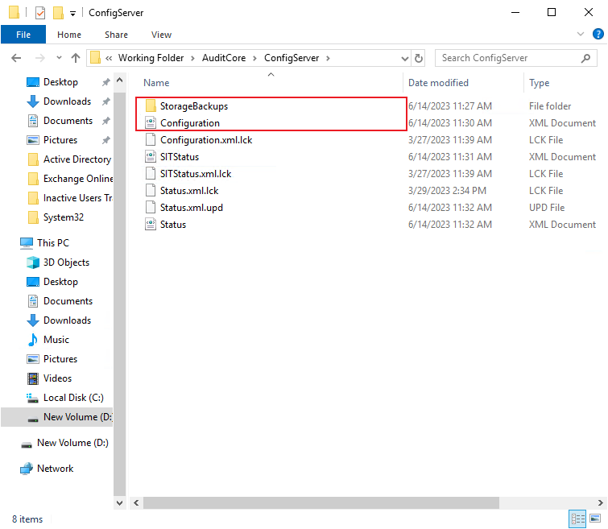
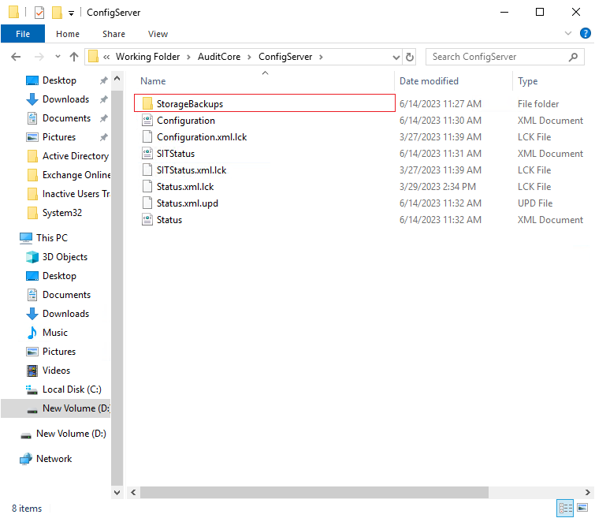
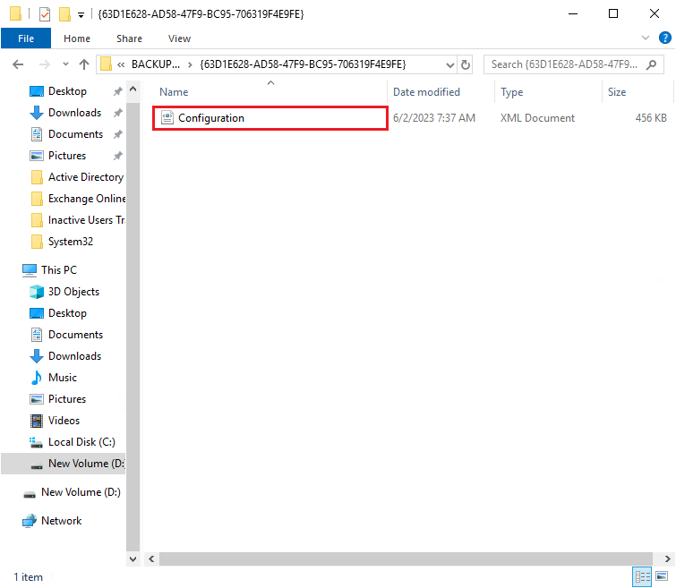
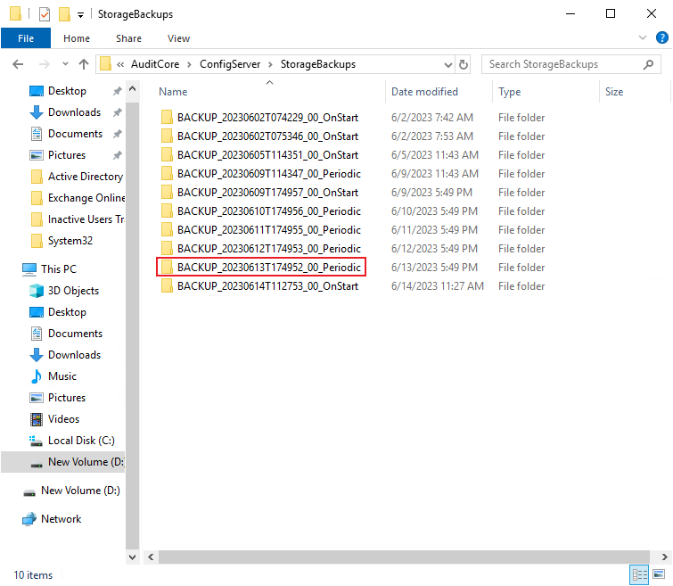

# Netwrix Auditor Configuration Server Service Fails to Start — Too Many Methods to Fire Events From

## Symptoms

- Netwrix Auditor Configuration Server Service stopped. When attempting to restart the service, it stops again with the following message in Netwrix Auditor System Health log:

```
Windows could not start the Netwrix Auditor Configuration Server Service service on Local Computer.
Error 0x80040209: An interface has too many methods to fire events from.
```



Other services are running as expected.



- The following error is prompted in the main Netwrix Auditor screen:

```
Connection failed
Access is denied
```



Upon checking Services running, Netwrix Auditor Configuration Server Service appears to have stopped. When attempting to restart the service, the same error is prompted.

## Causes

Any of the following potential causes may lead to corruption of the configuration server status file:

- The C drive of the Netwrix Auditor server has reached or is running out of its capacity.
- Unexpected shutdown of the Netwrix Auditor server (e.g. due to the power outage).
- Cross-program interaction (e.g. antivirus software blocks an operation performed by Netwrix Auditor).

## Resolution

Refer to the following steps to troubleshoot the issue:

1. Back up the ConfigServer folder located in ` %Working Folder%\AuditCore\ConfigServer`.
2. Delete all files in the original ConfigServer folder except for the StorageBackups folder and the Configuration.xml file.



3. Restart Netwrix Auditor Configuration Server Service.
4. Make sure the following services are running (including all the monitoring plan-related services):

- Netwrix Auditor Core Service.
- Netwrix Auditor Archive Service.

In case the aforementioned steps did not help, refer to the following steps to troubleshoot the issue:

1. Back up the ConfigServer folder located in ` %Working Folder%\AuditCore\ConfigServer`.
2. Delete all files in the original ConfigServer folder except for the StorageBackups folder. It is located in ` %Working Folder%\AuditCore\ConfigServer`.



3. Copy the Configuration.xml file from the latest **BACKUP_%DATE%**\%GUID% folder.



4. Paste the copied Configuration.xml file to ` %Working Folder%\AuditCore\ConfigServer`.
5. Restart Netwrix Auditor Configuration Server Service.
6. Make sure the following services are running (including all the monitoring plan-related services):

- Netwrix Auditor Core Service.
- Netwrix Auditor Archive Service.

> **NOTE:** If these steps did not help, try using the Configuration.xml file from the second to the last **BACKUP_%DATE%**\%GUID% folder. Paste the file to ` %Working Folder%\AuditCore\ConfigServer` and restart Netwrix Auditor services.



> **NOTE:** If the issue reoccurs after some time, contact [Netwrix Technical Support](https://www.netwrix.com/open_a_ticket.html).
