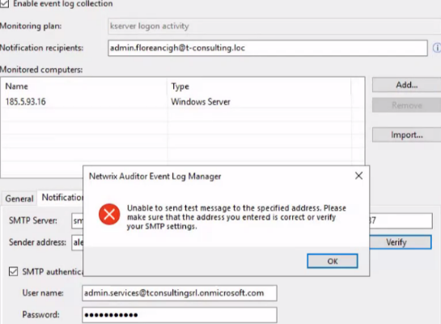

# Netwrix Auditor Event Log Manager shows SMTP authentication errors while configuring a monitoring plan

## Symptom

1. Netwrix Auditor Event Log Manager does not collect logs and shows the following error while trying to 'verify' if the messages were being sent in the Event Log Manager monitoring plan.  
   

2. When providing credentials for the Netwrix Auditor Event Log Manager monitoring plan, the following dialog appears:

```
The specified account cannot be verified. The user name or password is incorrect.
```

## Cause

This error occurs when using o365 SMTP Server that requires TLS 1.2 enabled on the computer that hosts Netwrix Auditor Server and on the target server(s).

## Resolution

Follow the steps below to resolve the issue:

1. Make sure that TLS 1.2 is enabled on the target server:
   - Open **Registry Editor** and navigate to `HKEY_LOCAL_MACHINE\SYSTEM\CurrentControlSet\Control\SecurityProviders\SCHANNEL\Protocols\TLS 1.2\Client\Enabled`.
   - If enabled, the key value should be `"1"`.
   - For additional information about TLS enabling, refer to the following article: Сonnection Issue when TLS 1.2 Is Required.

2. Configure all .NET Framework keys on the Netwrix Auditor and target server(s). Use the [download link](https://netwrix.com/download/products/KnowledgeBase/TLSRegkey.reg) to configure registry keys automatically. Run the file on your Auditor Server and all target servers.

3. On the target server, open **Registry Editor** and navigate to `HKEY_LOCAL_MACHINE\SYSTEM\CurrentControlSet\Control\SecurityProviders\SCHANNEL`. Change the **EventLogging** value to `"7"`.

4. If the settings listed above are configured correctly, but the issue persists, also consider checking the **WinHTTP** settings. On the target server, open **Registry Editor** and check the following registry keys:

   Learn more in [Update to enable TLS 1.1 and TLS 1.2 as default secure protocols in WinHTTP in Windows ⸱ Microsoft](https://support.microsoft.com/en-us/topic/update-to-enable-tls-1-1-and-tls-1-2-as-default-secure-protocols-in-winhttp-in-windows-c4bd73d2-31d7-761e-0178-11268bb10392)

   - `HKEY_LOCAL_MACHINE\SOFTWARE\Microsoft\Windows\CurrentVersion\Internet Settings\WinHttp\DefaultSecureProtocols = (DWORD): 0xAA0`
   - `HKEY_LOCAL_MACHINE\SOFTWARE\Wow6432Node\Microsoft\Windows\CurrentVersion\Internet Settings\WinHttp\DefaultSecureProtocols = (DWORD): 0xAA0`

5. Restart both: Netwrix Auditor and the target server(s).
