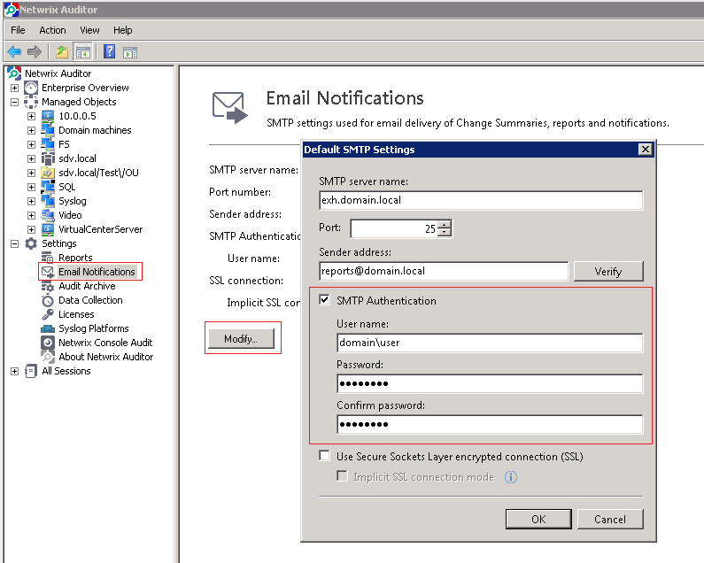
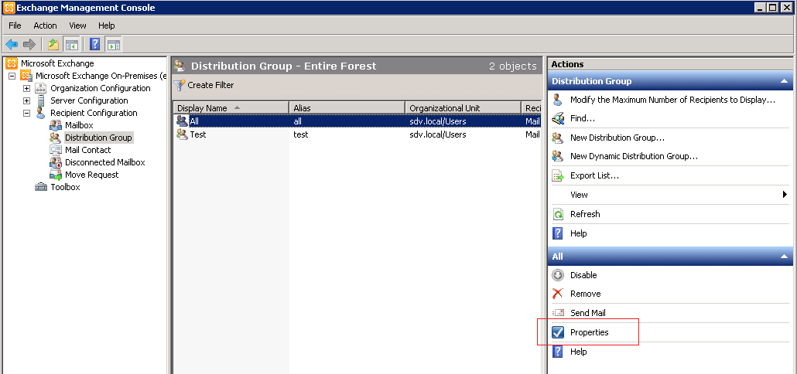
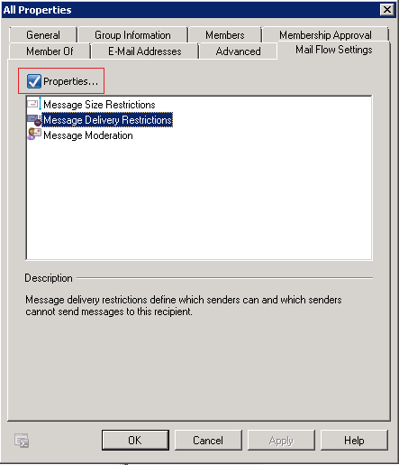
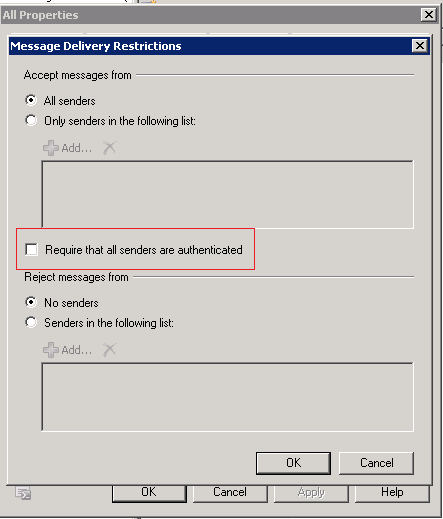

# Notifications are not sent to distribution groups

If you specify a user's e-mail address as a recipient, notifications work. If you specify a distribution group as the recipient, notifications do not come through.

---

This is related to authentication settings.

By default, even if the Exchange receive connector accepts anonymous SMTP, sending to distribution groups requires clients to be authenticated.

http://technet.microsoft.com/en-us/library/bb629676%28v=exchg.80%29.aspx

---

There are two solutions:

1. Configure SMTP authentication in the settings of the **Netwrix Auditor** management console

   

2. Disable the "require authentication" option in distribution group options as follows

   1. Launch **Exchange Management Console**  
   2. Navigate to **MS Exchange - Recipient configuration - Distribution groups**  
   3. Select the required distribution group and open its **Properties**

      

   4. Go to **Mail Flow Setting** tab  
   5. Select **Message Delivery Restrictions** from the list and open its **Properties**

      

   6. Uncheck **Require that all senders are authenticated** and click **OK**

      

   Alternatively, you can run the following command via Exchange Management Shell:

   ```powershell
   Set-Mailbox -RequireSenderAuthenticationEnabled $false -Identity %group%,
   ```

   where ` %group% ` is like `dynamic.group@example.com`
