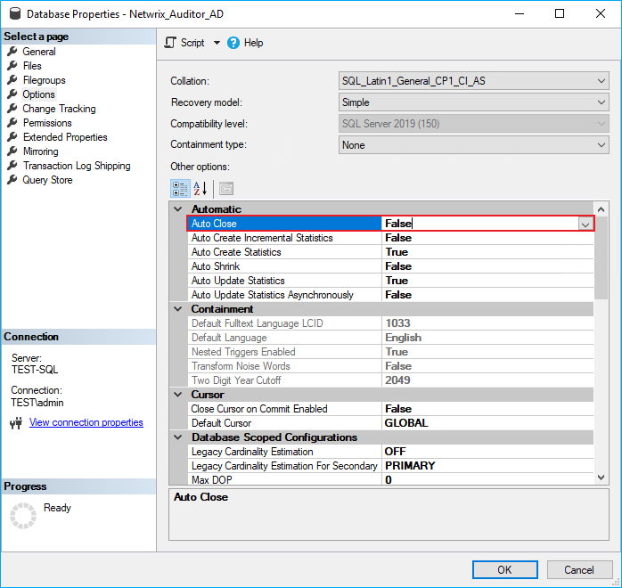

# Parallel Redo Events in SQL Server Event Log

## Symptom

The following **Information** level events are prompted in the SQL Server event log:

```text
Source: MSSQLSERVER
Event ID: 17137
Description: Starting up database '%database_name%'.
```

```text
Source: MSSQLSERVER
Event ID: 49930
Description: Parallel redo is started for database '%database_name%' with worker pool size [2].
```

```text
Source: MSSQLSERVER
Event ID: 49930
Description: Parallel redo is shutdown for database '%database_name%' with worker pool size [2].
```

## Cause

The AUTO_CLOSE option for the affected database is set to **ON\** **True**.

> **NOTE:** This behavior is expected with the AUTO_CLOSE option set to **True**. The AUTO_CLOSE option prompts the affected database to be closed after each use. Netwrix Auditor accesses the databases to write collected Activity Records, causing multiple 17137 and 49930 events to occur and be logged.

## Resolution

Disable the AUTO_CLOSE option for the affected database:

1. In your SQL server, launch Microsoft SQL Server Management Studio and connect to the server.
2. In the **Object Explorer** pane, expand the **Databases** folder.
3. Right-click the affected database and select **Properties**.
4. In the left pane, select the **Options** tab, locate the **Auto Close** option under the **Automatic** section, and select the **False** option from the drop-down list.



5. Click **OK** to save changes.

## Related articles

- Set the AUTO_CLOSE Database Option to OFF ⸱ Microsoft 🤝  
  https://learn.microsoft.com/en-us/sql/relational-databases/policy-based-management/set-the-auto-close-database-option-to-off?view=sql-server-ver16#for-more-information
