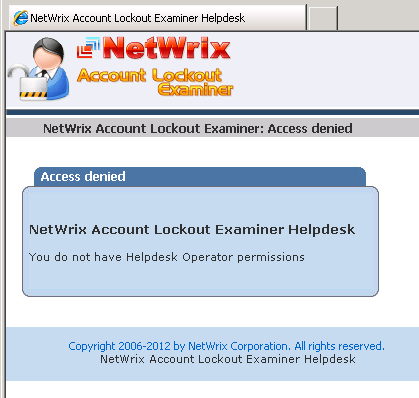

# Permission denied, error code -2146828218

When trying to access the Help-Desk portal, a non-admin user gets a "You do not have a Helpdesk operator permissions" message or "Permission denied" error (error code -2146828218)

---

## Cause

This message occurs because the user whose credentials were used to enter the Helpdesk portal is not granted Help-Desk operator role in the product settings.

---

## Resolution

To grant a user access to the Help-Desk portal, add this user to the Help Desk Operators role.

### To do this, perform the following steps:
1. In the Account Lockout Examiner console, navigate to **File > Settings** and select the **Security roles** tab.  
2. In the **Help-Desk Operators** section, click the **Modify** button.  
3. In the dialog that opens, click the **Add** button and specify user(s) that you want to add to this role.

If the issue persists, check that Authentication options are configured properly in IIS:

4. Start the IIS Manager and navigate to your Account Lockout Examiner web portal virtual directory (by default - `Default Web SiteALE`).  
5. Select this folder by left-clicking on it and look for the **Authentication** feature under the IIS block in the central pane. Double-click on it.  
6. Make sure that `"Anonymous Authentication"` is disabled.

