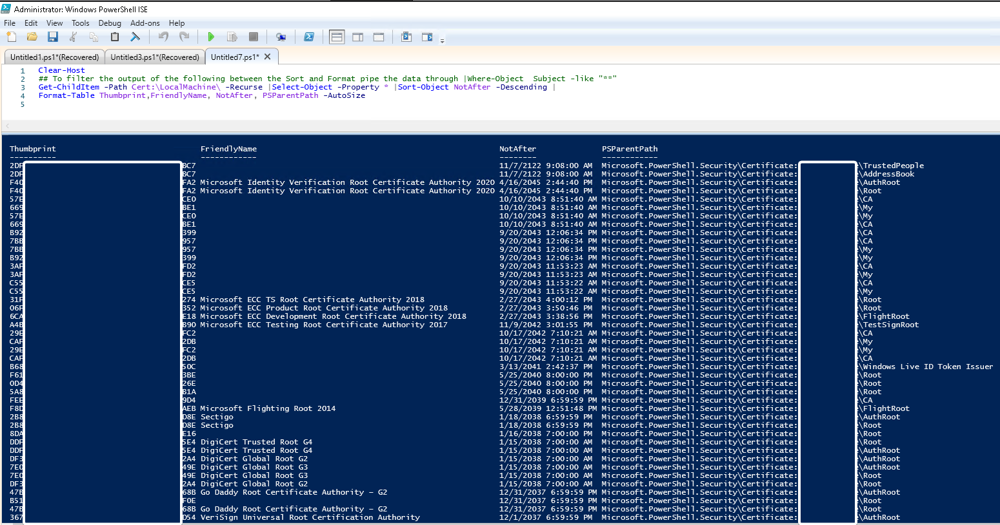

# Retrieving a List of Expiring SSL/TLS Certificates and Their Expiration Dates

> **IMPORTANT:** If you are using Netwrix Access Analyzer (formerly Enterprise Auditor) v12.0, you may refer to the following [7.Certificate Authority Job Group](/docs/accessanalyzer/12.0/solutions/activedirectory/certificateauthority/overview). This job should be functional in v12.0, but if not, you should contact [Netwrix Technical Support](https://www.netwrix.com/support.html) to open a ticket and proceed with the following steps as a workaround.

## Overview

This article provides instructions on how to retrieve a list of SSL/TLS certificates installed on your system, if using a pre-v12.0 version, along with their expiration dates. This can be useful for monitoring and ensuring timely certificate renewal.

## Instructions

Follow the steps below to obtain the list of SSL/TLS certificates and their expiration dates:

1. Open an Admin PowerShell or ISE window.
2. Run the following PowerShell command to retrieve the certificates:

   ```powershell
   Get-ChildItem -Path Cert:\LocalMachine\ -Recurse |
   Select-Object -Property * |
   Sort-Object NotAfter -Descending |
   Format-Table Thumbprint, FriendlyName, NotAfter, PSParentPath -AutoSize
   ```

**NOTE:** Expiration dates are noted as **NotAfter**, which indicates when the certificate will no longer be valid.

### Optional Filtering

If you need to filter the output, follow these steps:

1. Modify the command by adding a `| Where-Object Subject -like "*EDIT-AS-NEEDED*"` clause between the `Sort` and `Format` pipes.
2. Replace `*EDIT-AS-NEEDED*` with the desired filter criteria.

Your results should resemble the following example output:

