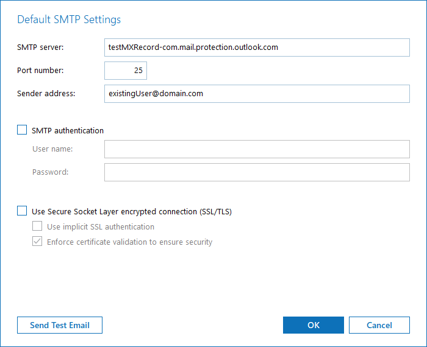
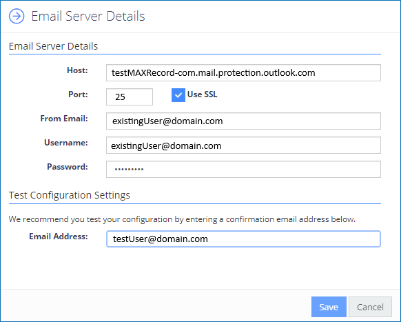

# Set Up Direct Send for Netwrix Auditor and Netwrix Data Classification

## Question

How to set up direct send via Microsoft 365 or Office 365 for Netwrix Auditor or Netwrix Data Classification?

## Answer

### Prerequisites

- Port `25` is required and must be unblocked in your network.
- A static IP address is recommended for an SPF record to be created for your domain. Learn more on SPF in [Set up SPF to Help Prevent Spoofing ⸱ Microsoft &#129125;](https://learn.microsoft.com/en-us/microsoft-365/security/office-365-security/email-authentication-spf-configure?view=o365-worldwide).

### Settings for Netwrix Auditor notifications

In the main Netwrix Auditor menu, click **Settings**. In the left pane, select the **Notifications** tab. Click **Modify** under the **Default SMTP Settings** section. The following settings should be used for Netwrix Auditor to implement direct send in your environment:

- Specify your MX endpoint in the **SMTP server** field.
- Specify port `25` in the **Port number** field.
- Specify any email address for one of your Microsoft 365 or Office 365 accepted domains in the **Sender address** field. This email does not need to have a mailbox.
- The use of SSL/TLS is optional.



> **NOTE:** When sending messages from a static IP, add the IP to your SPF record in your domain registrar's DNS settings to avoid having messages flagged as spam:
>
> ```text
> v=spf1 ip4:%Static IP Address%include:spf.protection.outlook.com ~all
> ```

### Settings for Netwrix Data Classification notifications

In the main Netwrix Data Classification screen, click **Settings**. In the left pane, select the **Communication** tab, and click **Email Servers**. Click **Add** to create a separate email server configuration. The following settings should be used for Netwrix Data Classification to implement direct send in your environment:

- Specify your MX endpoint in the **Host** field.
- Specify port `25` in the **Port number** field.
- Specify any email address for one of your Microsoft 365 or Office 365 accepted domains in the **Sender address** field. This email does not need to have a mailbox.
- The use of SSL is optional.



> **NOTE:** Direct send does not support SMTP AUTH. You can enter any SMTP credentials to proceed.

Learn more on direct send in [Send Email Using Microsoft 365 or Office 365 ⸱ Microsoft &#129125;](https://learn.microsoft.com/en-us/Exchange/mail-flow-best-practices/how-to-set-up-a-multifunction-device-or-application-to-send-email-using-microsoft-365-or-office-365?redirectSourcePath=%252fen-gb%252farticle%252fhow-to-set-up-a-multifunction-device-or-application-to-send-email-using-office-365-69f58e99-c550-4274-ad18-c805d654b4c4#option-2-send-mail-directly-from-your-printer-or-application-to-microsoft-365-or-office-365-direct-send).
