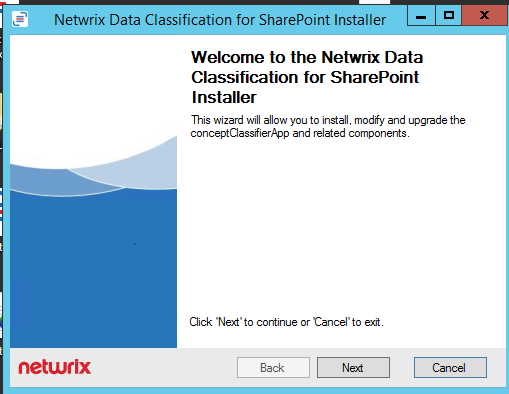
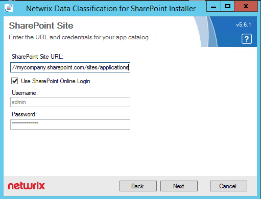
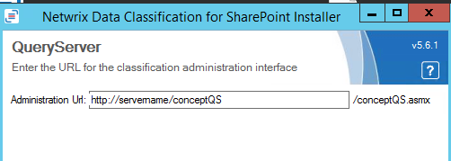

# SharePoint Application Installation for Netwrix Data Classification

This guide is for deploying the SharePoint application. This is the app needed for enabling write-back within SharePoint.

The `conceptClassifierAppInstaller.exe` can be used to install or upgrade the `conceptClassifierApp`. [Download](https://www.netwrix.com/download/Netwrix_Data_Classification_for_SharePoint.zip) and copy this file to your local server:

- `ConceptClassifierAppInstaller.zip`

Extract the files and run `conceptClassifierAppInstaller.exe`.

1. Click *next* after reading the wizard introduction and recommendations.

Read and confirm that you accept the EULA and click *next*.

Specify connection details for your organization's app catalog (you may have more than one of these if you are working across multiple web applications; if so, you will need to run the installer once per app catalog).

Enter the location of the conceptSearching server (which must be installed onto a secure server with a secure (HTTPS) endpoint): in the case of SharePoint Online, the certificate used must be externally verifiable (from a trusted source).  
Select the **Use SharePoint Online Login** checkbox if you want to use the new authentication method.

Please also note, the HTTPS binding in IIS should have the host header specified — in the case of the above example the host header would be `secure.conceptsearching.com`. To do this please follow these steps:

## Configure the IIS HTTPS binding host header

Open Internet Information Services (IIS) Manager

1. Open Internet Information Services (IIS) Manager
2. Edit the Site Bindings for the website you which to assign an SSL certificate (right-click, select **Edit Bindings**)
3. Select the HTTPS port and select **Edit**
4. Where possible edit the Host Name (Host Header field); if it is not possible please continue:
5. Launch the Microsoft Management Console (MMC)
   - Select Start → Run
   - Type in `MMC` and hit enter
   - From the console, select **File → Add / Remove Snap-in**
   - Select **Certificates** from the Add / Remove dialog
   - Select **Computer Account** when prompted for which certificates the snap-in will manage
   - Select **Local Computer** when prompted
   - Click **OK** to add the Snap-in to the MMC
6. Locate your SSL certificate
   - For self-signed (SELFSSL), look in **Personal**
   - For installed / purchased, look in the appropriate folder the certificate was originally installed in
7. Right-click on the certificate and select **Properties**
8. Edit the **Friendly Name** field so the name starts with an `*`
9. Repeat steps #1 – 3 above

Note that the Host Name (Host Header) field is now available for editing.

Assuming you have not completed any of the steps of the installation previously you will then be shown the following screen, otherwise (if this is an upgrade), the installer will indicate that you can skip this step.

This screen provides the information required to configure the app principal registration information which allows the conceptSearching products to communicate with SharePoint.

Please follow the link provided and enter the information as shown. You will be required to generate a "Client Secret"; this is required for Azure ACS enabled environments, and not for on-premise environments that wish to use a certificate trust configuration. Click the "Generate" button for the client secret and make a note of this in a secure location. Here is an example of the completed registration form:

The app should then be ready for installation, click "Install" to proceed.

The app will now be deployed to your app catalog and ready for installation on your site collections.

---

### If you wish to use the conceptClassifierApp in an on-premise environment you will need to complete a few additional steps shown in step 1, otherwise, skip to step 2.

#### 1. Building the trust relationship for an on-premise environment

(A) To begin the app model should be enabled on the farm. By following the steps in the following link the SharePoint farm will be ready to make use of any SharePoint apps:

http://technet.microsoft.com/en-us/library/fp161236(v=office.15).aspx

(B) Next, it is necessary to build a trust relationship between the SharePoint server and the server that will be hosting the conceptQS; this is to allow the QS to make requests back to SharePoint (please note that this is still necessary even if the QS is hosted on the same server as the SharePoint site). Please now proceed through the following help guide:

http://msdn.microsoft.com/en-us/library/office/fp179901(v=office.15).aspx

#### 2. Configuring the services with the authentication configuration

First, navigate to the following URL:

`/conceptQS/Sources/SharePoint/AppConfiguration`

Select the appropriate tab:

- Azure Access Control Service (ACS) should be used for Office 365
- Server-to-Server (S2S) should be used for an on-premise environment

Please complete the necessary fields. If you are an Office 365 customer you will need your client secret; otherwise, you will need the values completed in step 1(B) above.

---

### If you would like to continue with the deployment of the SharePoint Application:

[Follow this article](https://kb.netwrix.com/5505)
