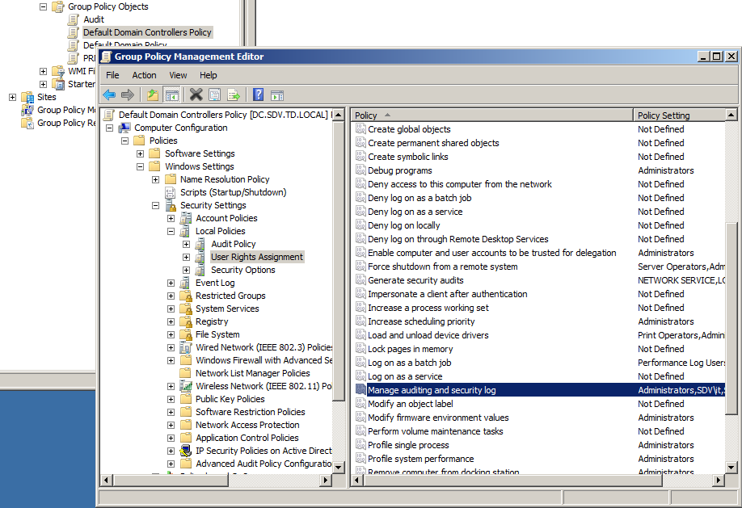
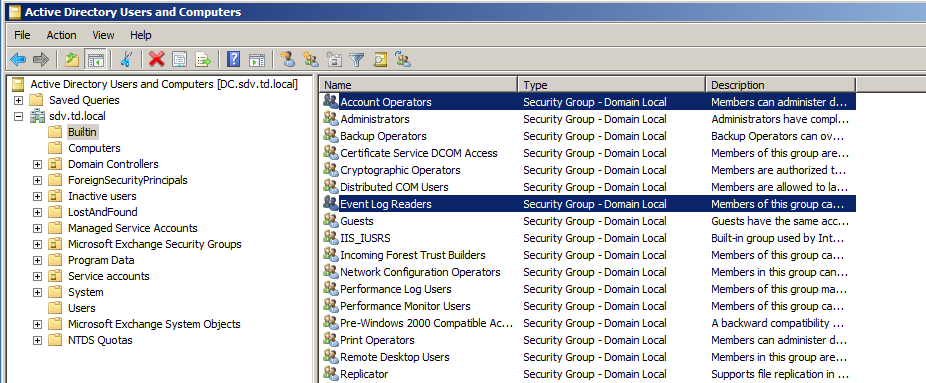
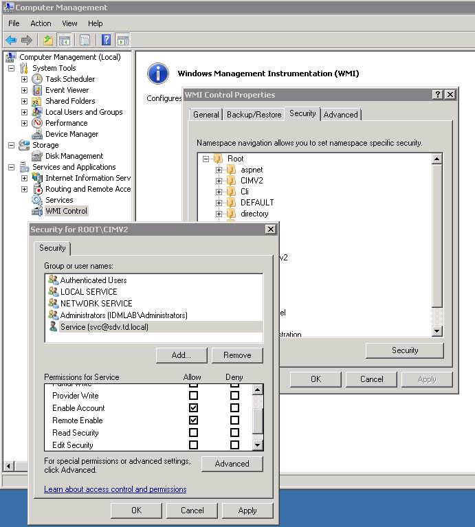
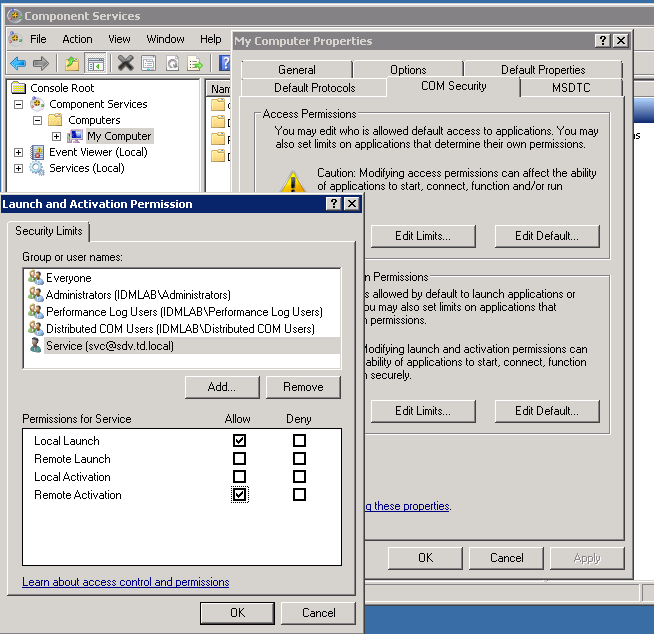
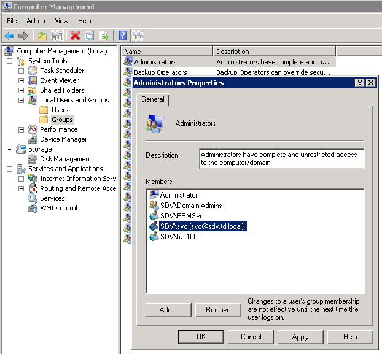

# The Account Lockout Examiner service account

If you do not want to grant Domain Admin rights to the service account, you can create a less-privileged one. To create an account that has all required rights, perform the following steps.

On any Domain Controller that has Group Policy Management:

## Step 1. Enable the Manage auditing and security log user right for this account
1. Run **Group Policy Management**  
2. Navigate to the Group Policy Object applied to all Domain Controllers (for example, **Default Domain Controllers Policy**)  
3. Right-click on it and select **Edit**  
4. Expand **Computer Configuration -> Windows Settings -> Security Settings -> Local Policies -> User Rights Assignment**  
5. Double-click the **Manage auditing and security log** policy  
6. Click **Add user or group**, specify the Account Lockout Examiner **service account**, and click **OK**

## Step 2. Add the service account to the required security groups
1. Run **Active Directory Users and Computers**  
2. Expand **`<Domain name>` - Built-in**  
3. Click the **Account Operators** group and select **Properties**  
4. Go to the **Members** tab and add the user account you want to use for the Account Lockout Examiner service to the list  
5. For **Windows 2008 and above** Domain Controllers, add the service account to the **Event Log Readers** group

## Step 3. On every monitored Domain Controller, enable WMI access
1. Run **Computer Management** (Start -> Administrative Tools -> Computer Management)  
2. Expand **Services and Applications -> WMI Control**  
3. Right-click on it and select **Properties**  
4. Go to the **Security** tab and expand **Root -> CIMV2**  
5. Highlight **CIMV2** and click the **Security** button at the bottom of the window  
6. Add the user account you want to use for the Account Lockout Examiner service to the list  
7. Grant it the **Remote Enable** permission (put a check in the **Allow** checkbox)

## Step 4. Configure DCOM settings
1. Open **Component Services** (Start -> Programs -> Administrative Tools -> Component Services)  
2. Navigate to **Component Services - Computers - My Computer**. Right-click it and select **Properties**  
3. Go to the **COM Security** tab  
4. Click the **Edit Limits** button in the **Launch and Activation Permissions** group box  
5. Add the user account you want to use for the Account Lockout Examiner service to the top window  
6. Set the **Allow** checkbox for the **Remote Activation** option

**NOTE:** Steps 3 and 4 might require a reboot to apply the new settings.

## Step 5. On the machine where NetWrix Account Lockout Examiner is installed, grant local administrator rights to the service account
1. Run **Computer Management**  
2. Expand **System Tools -> Local Users and Groups -> Groups**  
3. Right-click the **Administrators** group and select **Add to group**  
4. Click **Add** and specify the service account. Click **OK**

## Step 6. On all machines that need to be examined by Account Lockout Examiner, grant local administrator rights to the service account
- Grant local administrator rights either manually or by Group Policy.  
- Local admin rights are also necessary to find the root process causing invalid logons.
