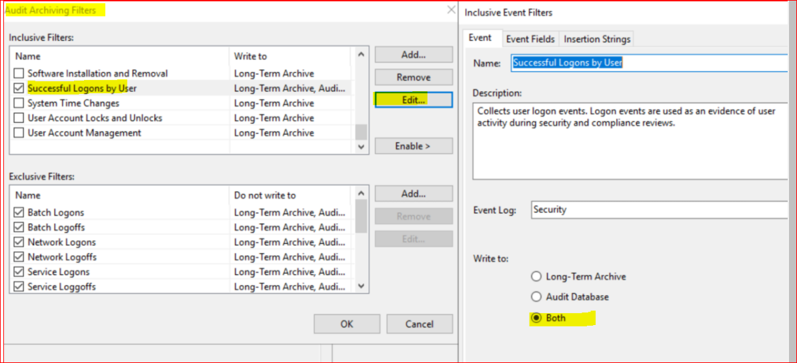

# The Event Logs reports for Windows Server does not contain any data

## Symptom

You have configured a **Windows Servers** monitoring plan in Netwrix Auditor, the data is being collected, however, the reports under **Windows Server** -> **Event Log** do not show any data.

## Cause

To review your data in these reports, you should configure a monitoring plan for Netwrix Auditor Event Log Manager.

## Resolution

1. On the computer that hosts Netwrix Auditor Server, run Netwrix Auditor Event Log Manager.
2. Navigate to Audit Archiving filters and configure them as described in Configure Audit Archiving Filters for Event Log.  
   
3. Perform any test changes, for example, log in to a server for which you want to review data in reports.
4. Wait for 10 - 15 minutes for changes to take effect and run reports.
